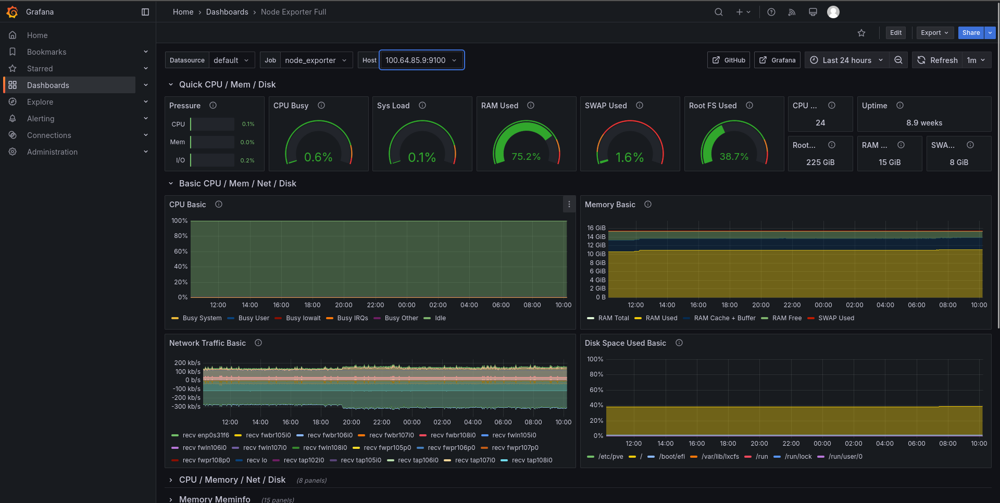
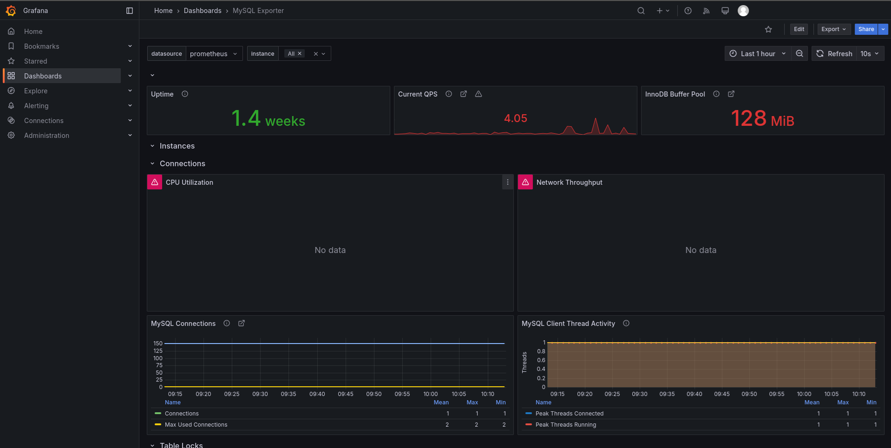

# Setting Up a Bastion Server
VANNESTE Lucas - SLIMANI Robin


## Table of Contents

1. [Introduction](#introduction)
2. [Project Context](#project-context)
3. [Choice of Bastion Technology](#choice-of-bastion-technology)
4. [Comparison of Solutions](#comparison-of-solutions)
5. [Architecture and Infrastructure](#architecture-and-infrastructure)
6. [Interview Report](#interview-report)
7. [Complete Description of the Final Chosen Infrastructure](#complete-description-of-the-final-chosen-infrastructure)
8. [Installation and Configuration](#installation-and-configuration)
9. [Implemented Features](#implemented-features)
10. [Encountered Problems and Solutions](#encountered-problems-and-solutions)
11. [Conclusion](#conclusion)
12. [Appendices](#appendices)

## Introduction

This project aims to establish a centralized bastion server, enabling administrators to manage and secure access to various servers and services in a multi-client environment. The bastion must be flexible, scalable, and capable of adapting to diverse technological configurations. It aims to simplify SSH connection management by using certificates instead of passwords and usernames, while centralizing access to avoid managing multiple IP addresses. Additionally, the bastion should offer advanced features such as two-factor authentication, connection logging, and a web or CLI interface for management.

### Project Objectives

1. **Centralized Access Management**: The bastion should enable centralized management of connections to various servers and services, using certificates to enhance security.

2. **Flexibility and Adaptability**: The system must be flexible enough to adapt to diverse technological environments, including Docker configurations, databases, SaaS services, and FTP servers.

3. **Enhanced Security**: Implementing two-factor authentication and connection logging is essential to ensure a high level of security.

4. **User Interface**: Provide an intuitive web or CLI interface to allow administrators to easily manage access and connections.

5. **Granular Access Management**: Enable fine-grained access management based on the roles of administrators and the specific needs of clients.


## Project Context

The project is set in a context where a company needs to manage access to various environments for multiple clients. Each client may have several environments (development, staging, production), each consisting of various services such as databases, web servers, cache servers, etc. The bastion should allow connections to be sorted by client and environment, providing structured and secure access management.

### Expected Features

To meet the company's needs, the bastion should offer the following features:

1. **Centralized Connection**:
   - Sort connections by client and environment.
   - Allow access to various services such as databases, web servers, cache servers, etc.

2. **Technological Flexibility**:
   - Adapt to varied configurations, including Docker environments, SaaS services, and traditional servers.
   - Support specific technologies like MongoDB Atlas, Redis, and FTP servers.

3. **Specific Actions**:
   - Connect directly to database prompts (MariaDB, MongoDB, Redis).
   - Mount remote folders locally with SSHFS.
   - Perform database dumps and restorations.
   - Initiate RDP connections to Windows servers.

4. **Access Management**:
   - Allow granular access management based on administrator roles.
   - Offer advanced features such as two-factor authentication and connection logging.

5. **Standard Technologies**:
   - Operate with standard technologies without requiring the installation of specific utilities on the servers.

### Bonus

- **Two-Factor Authentication**: To enhance connection security.
- **Connection Logging**: To ensure traceability of access and actions performed.
- **CLI for Administrators**: To provide a command-line interface in addition to the web interface.
- **Tunnel Creation**: To access services not directly accessible, such as DBeaver on a remote server.

## Clarifications

The solution should be self-hosted and run on a dedicated server, such as a small VPS. The form of the solution is flexible and can include a web application, a suite of bash scripts, a customized SSH server, or a customized open-source solution. Solutions like Apache Guacamole and Teleport can serve as inspiration for implementing this project.


## Choice of Bastion Technology

After an in-depth comparative analysis, two main technologies were considered for implementing the bastion server: **Apache Guacamole** and **Teleport**. Each of these solutions has advantages and disadvantages that make them suitable for different contexts and needs.

### Comparison of Solutions

| Criteria                 | Apache Guacamole                                      | Teleport                                                                 |
|--------------------------|------------------------------------------------------|--------------------------------------------------------------------------|
| **Protocol Access**      | RDP, VNC, SSH via a web interface                    | SSH, RDP, Kubernetes API, databases                                     |
| **User Interface**       | Intuitive web interface accessible from any browser, without requiring additional clients. | Provides a web interface as well as command-line tools, suitable for DevOps environments and automated workflows. |
| **Access Management**    | Integration with LDAP and other authentication systems for user and permission management. | Offers granular access management based on roles, with least privilege policies and Zero Trust principles compliance. |
| **Logging and Audit**    | Connection logging features, but with limited capabilities in terms of detail and in-depth analysis. | Provides detailed session logging, including user activity recording, facilitating security audits and regulatory compliance. |
| **Scalability and Cloud Environment** | Primarily designed for traditional environments, with limitations in cloud-native and distributed environments. | Designed for cloud-native environments, with horizontal scalability and efficient management of distributed and multi-cloud infrastructures. |
| **Advanced Security**    | Multi-factor authentication (MFA) and connection encryption, but may require additional configurations for advanced security features. | Integrates advanced security features such as passwordless authentication, FIDO2/U2F keys, and native compliance with modern security standards, enhancing overall security posture. |
| **Integration and API**  | Documented APIs for integration with other applications, although the scope may be limited. | Offers robust APIs and seamless integration with various DevOps tools, facilitating automation and workflow orchestration. |
| **Cost and License**     | Free open-source solution under the Apache 2.0 license, with community support. | Provides an open-source version with basic features, as well as commercial offerings for advanced features and dedicated support. |

### Why Choose Teleport?

1. **Adaptability to Varied Environments**:
   - Our project involves managing multiple clients and environments using diverse technologies, including Docker-hosted services, SaaS databases, and non-Docker servers. Teleport, with its multi-protocol support and cloud-native design, offers the flexibility needed to adapt to these heterogeneous configurations.

2. **Granular Access Management**:
   - The need to define specific permissions for different administrators requires a solution capable of managing detailed access policies. Teleport allows for fine-grained role and permission management, aligned with the principles of least privilege and Zero Trust, ensuring that each administrator has only the access necessary for their functions.

3. **Enhanced Security**:
   - With features such as passwordless authentication, native support for hardware security keys (FIDO2/U2F), and comprehensive session logging, Teleport provides robust security essential for protecting sensitive environments and meeting compliance requirements.

4. **Scalability and Performance**:
   - Designed for modern, distributed infrastructures, Teleport can scale efficiently with the growth of our organization, ensuring optimal performance even at a large scale.

5. **Integration and Automation**:
   - Teleport's robust APIs and seamless integration with DevOps tools facilitate workflow automation, improving operational efficiency and reducing the risk of human errors.

### Conclusions

While Apache Guacamole offers interesting features for remote access via a web interface, Teleport stands out for its ability to manage complex and varied environments, advanced security, and scalability. These characteristics make it a more suitable solution for the specific needs of our connection bastion project. Teleport not only centralizes and secures access but also adapts to the modern requirements of cloud-native infrastructures while offering optimal flexibility and integration with DevOps tools.

## Architecture and Infrastructure

### Infrastructure Diagrams

#### Infrastructure with Teleport


#### Infrastructure with Apache Guacamole


## Interview Report

To guide our technological choice for the bastion server project, we had the opportunity to interview a professional in the field. This exchange allowed us to better understand the advantages and disadvantages of the various available solutions and to steer towards the most suitable solution for our needs.

### Main Solution: Teleport

**Professional Recommendation:**
- **Teleport** was chosen as the primary base for our project. This solution offers advanced security features, including multi-factor authentication and connection auditing. It also provides centralized and intuitive access management while offering great flexibility to integrate various technologies such as Docker, databases, and SaaS services.

**Advantages of Teleport:**
- **Enhanced Security**: Multi-factor authentication and detailed session logging.
- **Centralized Management**: Intuitive interface for managing access and roles.
- **Flexibility**: Ability to integrate with diverse environments and technologies.

### Other Proposed Solutions

**Open Source:**

1. **Apache Guacamole:**
   - **Advantage**: Intuitive web interface for managing RDP, SSH, and VNC connections.
   - **Integration**: Possibility of integration with Elasticsearch for logging via the SNLPL protocol.

2. **OpenNebula:**
   - **Usage**: For managing and orchestrating cloud resources.

3. **NoMachine:**
   - **Features**: High-performance remote access solution for RDP and SSH connections.

**Commercial:**

4. **Azure Bastion:**
   - **Features**: Azure's native cloud bastion, well-suited for Azure environments but less flexible for multi-cloud or on-premise setups.

5. **RustDesk and GoToResolve:**
   - **Usage**: Tools for remote access, but less suitable for a centralized bastion.

6. **Terraform:**
   - **Recommendation**: Primarily for infrastructure as code and automation.

### Recommended Infrastructure

**Hypervisor:**
- **Proxmox** was recommended for its ability to efficiently manage virtual resources.

**Service Distribution:**
- **VM 1**: Apache Guacamole.
- **VM 2**: OpenNebula or Teleport.

**Operating System:**
- **ArchLinux or ArchOS** for their lightweight and flexible nature.

**Tool for Windows ISOs:**
- **ChrisTitus Mcrowin (Winutil)** utility to create an optimized Windows ISO for VMs.

### Errors to Avoid

- **Certificates**: Always use valid certificates to secure connections.
- **Isolation**: Prefer Docker to isolate resources and reduce risks associated with shared environments.
- **Logging**: Do not neglect logs, which are essential for auditing and security.

### Additional Recommendations

- **Explore Existing Projects**: Look for custom bastion solutions or inspiration on GitHub.
- **Custom Solution**: Not recommended, as it is often less secure and functional than existing open-source solutions.

### Next Steps

- **Testing**: Test Teleport and Apache Guacamole to confirm their suitability for the project.
- **Infrastructure Configuration**: Based on Proxmox with two VMs to separate services.
- **Integration**: Integrate Elasticsearch with Teleport for connection logging.

### List of Solutions and Documentation

Here is a list of open-source solutions and GitHub projects for setting up a connection bastion, along with their official documentation links:

1. **Teleport**
   - Documentation: [Teleport](https://goteleport.com/docs/)

2. **Apache Guacamole**
   - Documentation: [Apache Guacamole](https://guacamole.apache.org/doc/)

3. **The Bastion (OVH)**
   - Documentation: [The Bastion (OVH)](https://ovh.github.io/the-bastion/)

4. **Bastillion**
   - Documentation: [Bastillion](https://github.com/bastillion-io/Bastillion)

5. **HashiCorp Boundary**
   - Documentation: [HashiCorp Boundary](https://www.boundaryproject.io/docs)

6. **NoMachine**
   - Documentation: [NoMachine](https://www.nomachine.com/documentation)

7. **OpenNebula**
   - Documentation: [OpenNebula](https://docs.opennebula.io/)

8. **Terraform**
   - Documentation: [Terraform](https://developer.hashicorp.com/terraform/docs)

9. **RustDesk**
   - Documentation: [RustDesk](https://rustdesk.com/docs/)

10. **GoTo Resolve**
    - Documentation: [GoTo Resolve](https://support.goto.com/resolve/help)

11. **Azure Bastion**
    - Documentation: [Azure Bastion](https://learn.microsoft.com/en-us/azure/bastion/)

12. **Jumpserver**
    - Documentation: [Jumpserver](https://www.jumpserver.org/en-us/docs/)

13. **WebTerminal**
    - Documentation: [WebTerminal](https://github.com/joewalnes/websocketd)

### Comparative Table of Solutions

| Solution                | Advantages                                                                 | Disadvantages                                                                 |
|-------------------------|--------------------------------------------------------------------------|-----------------------------------------------------------------------------|
| Teleport                | - Enhanced security with multi-factor authentication and audit.         | - May require complex initial configuration.                               |
|                         | - Native integration with various technologies.                         | - Some advanced features are reserved for the enterprise version.           |
| Apache Guacamole        | - Web-based remote access without additional client requirements.      | - Initial configuration can be complex.                                    |
|                         | - Supports RDP, SSH, VNC, and other protocols.                          | - May require adjustments for full integration.                            |
| The Bastion (OVH)       | - Centralized management of SSH access with traceability and auditability. | - Primarily focused on SSH connections.                                    |
| Bastillion              | - Web interface for managing SSH connections.                           | - Limited to SSH connections.                                              |
| HashiCorp Boundary      | - Dynamic access control based on identities.                           | - Relatively new solution, may lack maturity.                              |
| NoMachine               | - High performance for remote desktop access.                           | - Less suitable for centralized management of multiple servers.            |
| OpenNebula              | - Comprehensive cloud and virtualization management platform.          | - High complexity, may be excessive for a simple connection bastion.      |
| Terraform               | - Infrastructure as Code for resource management.                       | - Requires coding and infrastructure management skills.                   |
| RustDesk                | - Open-source solution for remote control.                              | - Limited features for centralized access management.                      |
| GoTo Resolve            | - Comprehensive remote support solution with management features.      | - Proprietary solution with associated costs.                              |
| Azure Bastion           | - Seamless integration with Azure services.                             | - Limited to Azure environments.                                           |
| Jumpserver              | - Open-source bastion focused on SSH and RDP connections.               | - Somewhat rudimentary user interface.                                     |
| WebTerminal             | - Lightweight solution for SSH connections via browser.                | - Limited features.                                                        |

### Additional Remarks

- **Certificates**: All exposed services must be protected by valid certificates to avoid compromise risks.
- **Logging**: Centralize logs using tools like Elasticsearch or Splunk for effective monitoring and auditing.

This interview was essential in guiding us towards the most suitable solution for our project, considering specific needs and technical constraints.


## Complete Description of the Final Chosen Infrastructure

### Global Architecture

The infrastructure set up for this bastion server project is designed to provide centralized and secure management of access to various client services and environments. It relies on several key components, each playing a specific role in security, access management, and performance monitoring.

### Main Bastion Server

**Central server hosting the following components:**

- **Teleport**: Manages connections and access. Teleport centralizes secure access to client environments, allowing fine-grained management of roles and permissions. It supports multi-factor authentication (MFA) and session recording for auditing.

- **Fail2ban**: Protects against brute force attacks. Fail2ban monitors logs generated by SSH and blocks IPs after a defined number of failed attempts.

- **Prometheus and Grafana**: Monitoring and dashboarding. Prometheus collects system and application metrics, while Grafana allows these data to be visualized for performance monitoring and anomaly detection.

### Client Services

**Various services hosted by clients, accessible via the bastion:**

- **Databases**: MariaDB, MongoDB, Redis.
- **Web Servers**: Apache, Nginx.
- **Docker Instances**: For development and staging environments.
- **SaaS Services**: Such as MongoDB Atlas.
- **RDP Servers**: For Windows environments.

### Monitoring and Logs

- **Prometheus**: Collects system and application metrics. It monitors the performance of Teleport services and client infrastructures and allows alerts to be configured for anomaly detection.

- **Grafana**: Visualizes data to monitor performance and detect anomalies. Grafana provides customizable dashboards to visualize metrics collected by Prometheus.

### Key Components

1. **Teleport (Connection Bastion)**
   - **Role**: Centralize secure access to client environments.
   - **Main Features**:
     - Access to SSH, RDP, Kubernetes servers, and databases.
     - Multi-factor authentication (MFA).
     - Session recording for auditing.
     - Role management for granular access assignment.
     - Creation of secure tunnels to access unexposed services.

3. **Fail2ban (Attack Protection)**
   - **Role**: Protect services from brute force attacks.
   - **Configuration**:
     - Monitors logs generated by SSH.
     - Blocks IPs after a defined number of failed attempts.

5. **Prometheus (Monitoring)**
   - **Role**: Collect and store system and application metrics.
   - **Main Features**:
     - Monitors the performance of Teleport services and client infrastructures.
     - Collects system metrics (CPU, memory, etc.).
     - Configurable alerts for anomaly detection (high CPU, latency, etc.).

6. **Grafana (Visualization Dashboards)**
   - **Role**: Provide customizable dashboards to visualize metrics collected by Prometheus.
   - **Main Features**:
     - Dashboards to monitor Teleport connections, client infrastructure status, and resource usage.

### Client Infrastructures

1. **Client Environment Types:**

   - **Client 1**:
     - Dev and Staging environments on shared Docker.
     - Production hosted on a dedicated server.

   - **Client 2**:
     - MongoDB Atlas database (SaaS).
     - Shared web servers for Staging and Production.

   - **Client 3**:
     - Simple FTP server for specific files.
     - Redis instance for caching.

   - **Client 4**:
     - Windows servers accessible via RDP.
     - MariaDB databases for business applications.

2. **Integration with the Bastion**:
   - Connections to client infrastructures are managed via Teleport, with secure SSH tunnels for unexposed services.
   - Specific actions (database connection, etc.) are preconfigured in Teleport.

### Advantages of the Infrastructure

- **Enhanced Security**:
  - MFA authentication.
  - Protection against brute force attacks (Fail2ban).

- **Effective Supervision**:
  - Prometheus monitors the performance of services and client infrastructures.
  - Grafana provides a clear overview and real-time alerts.

- **Flexibility and Scalability**:
  - Teleport easily manages varied client environments.


## Installation and Configuration

### Proxmox Installation

#### 1.1 Proxmox Installation

We began the project by installing Proxmox from an open-source ISO. This installation was performed on two separate machines, allowing us to create a cluster to pool resources and optimize the performance of virtual machines.

- **ISO Download**: We downloaded the Proxmox VE ISO from the official website.
- **Creation of Installation Media**: The ISO was used to create bootable installation media (USB drive or DVD).
- **Installation on Machines**: Each machine was booted from the installation media, and we followed the Proxmox VE installation process, including initial system configuration such as setting the IP address, hostname, and basic network settings.

#### 1.2 Network Configuration

We configured the network interfaces of our Proxmox server with the following settings:

- **vmbr0**: The primary interface connected to the external network with a static IP address. This interface allows virtual machines to access the external network and the Internet.

- **vmbr1**: The interface for the internal network of virtual machines with a private IP address. This interface enables communication between virtual machines within the cluster.

**Example Configuration of the `/etc/network/interfaces` File:**

```bash
auto lo
iface lo inet loopback

iface enp0s31f6 inet manual

auto vmbr0
iface vmbr0 inet static
    address 100.64.85.9/24
    gateway 100.64.85.254
    bridge-ports enp0s31f6
    bridge-stp off
    bridge-fd 0

auto vmbr1
iface vmbr1 inet static
    address 10.0.1.1/24
    bridge-ports none
    bridge-stp off
    bridge-fd 0
```

#### Setting Up Access Routes to Virtual Machines with Netplan

We configured access routes to virtual machines using Netplan, a network configuration tool for Ubuntu-based systems.

**Editing the `/etc/netplan/50-cloud-init.yaml` File:**

```yaml
network:
  version: 2
  ethernets:
    enp0s31f6:
      dhcp4: true
      nameservers:
        addresses:
          - 100.64.85.7
      routes:
        - to: 10.0.1.0/24
          via: 100.64.85.9
        - to: 10.0.0.0/24
          via: 100.64.85.13
```

**Applying the Changes:**

After editing the Netplan configuration file, we applied the changes with the following command:

```bash
sudo netplan apply
```

#### 1.3 Creating the Proxmox Cluster

To create the cluster, we used the comprehensive graphical interface of Proxmox VE. This interface provides an intuitive method for configuring and managing clusters, simplifying the process.

- **Cluster Initialization**:
  - We accessed the Proxmox web interface on one of the nodes.
  - In the "Datacenter" menu, we selected "Create Cluster" to initialize a new cluster.

- **Adding the Second Node**:
  - Still via the web interface, we added the second node to the cluster by providing its IP address and the necessary connection information.
  - The web interface guided the process, ensuring that both nodes were correctly configured and connected.

- **Cluster Validation**:
  - We checked the cluster status via the web interface to ensure that both nodes were operational and that resources were properly pooled.
  - The web interface also allowed us to monitor the performance and health of the cluster.

This configuration allows the pooling of resources from the two Proxmox nodes, providing a robust and scalable infrastructure for hosting the virtual machines required for the bastion project.

### DNS Configuration

To ensure efficient management of communications between our various virtual machines, we set up a DNS server using Bind9. This DNS server allows the creation of a subnet and the assignment of domain names to internal services, facilitating their identification and access. Additionally, another DNS server on an IUT machine resolves the name `teleport.teleport.com` to access the online Teleport client.

#### 1.3 Creating a DNS Server

**Objective:**
- Manage internal communications between virtual machines.
- Facilitate access to services via internal domain names.
- Configure an external DNS to resolve `teleport.teleport.com`.

**External DNS Server Configuration:**

1. **Installation of Bind9**:
   - We began by updating the system packages and installing Bind9:
     ```bash
     sudo apt update && sudo apt install bind9 -y
     ```

2. **Configuration of the External DNS Zone**:
   - **Editing the Configuration File**:
     - We added the DNS zone for `teleport.com` in the `/etc/bind/named.conf.local` file:
       ```bash
       zone "teleport.com" {
           type master;
           file "/etc/bind/db.teleport.com";
       };
       ```

   - **Creating the Zone File**:
     - The file `/etc/bind/db.teleport.com` was created with the following content:
       ```bash
       $TTL    604800
       @       IN      SOA     ns1.teleport.com. admin.teleport.com. (
                              2024122802 ; Serial (incremented)
                              604800     ; Refresh
                              86400      ; Retry
                              2419200   ; Expire
                              604800 )  ; Negative Cache TTL

       ; NS records
       @       IN      NS      ns1.teleport.com.
       ns1     IN      A       100.64.85.7

       ; A records
       @       IN      A       100.64.85.13
       teleport IN     A       100.64.85.13
       *.teleport IN   A       100.64.85.13
       ```

   - **Restarting the Bind9 Service**:
     - After configuring the files, we restarted the Bind9 service to apply the changes:
       ```bash
       sudo systemctl restart bind9
       ```

**Internal DNS Server Configuration:**

1. **Adding the Internal DNS Zone**:
   - We added the DNS zone for `teleport.teleport.com` in the Bind9 configuration file:
     ```bash
     zone "teleport.teleport.com" {
         type master;
         file "/etc/bind/db.teleport";
     };
     ```

2. **Creating the Internal Zone File**:
   - The file `/etc/bind/db.teleport` was created with the following content:
     ```bash
     $TTL 604800
     @   IN  SOA teleport.teleport.com. root.teleport.teleport.com. (
             2         ; Serial
             604800    ; Refresh
             86400     ; Retry
             2419200   ; Expire
             604800 )  ; Negative Cache TTL
     ;
     @   IN  NS  teleport.teleport.com.
     @   IN  A   192.168.1.10
     ```

**Remarks:**
- We used Bind9 for its robustness and ability to handle complex DNS configurations.
- The external DNS configuration resolves the name `teleport.teleport.com`, facilitating access to the Teleport service from outside the local network.
- The internal DNS configuration simplifies the management of domain names for internal services, improving the organization and accessibility of resources within the virtual network.

This DNS configuration ensures centralized and efficient management of network communications, facilitating maintenance and future expansion of the infrastructure.


### Teleport Installation

#### 3.1 Download and Installation

To install Teleport, we followed these steps:

1. **Retrieve the Package**:
   - We downloaded the Teleport installation package from the official site. The chosen version was the open-source (`oss`) edition of Teleport, specifically version `17.3.2`.
   - The following command was used to download and install Teleport:
     ```bash
     TELEPORT_EDITION="oss"
     TELEPORT_VERSION="17.3.2"
     curl https://cdn.teleport.dev/install-v17.3.3.sh | bash -s ${TELEPORT_VERSION?} ${TELEPORT_EDITION?}
     ```

#### 3.2 Teleport Configuration

1. **Create the Configuration File**:
   - We created a directory to store Teleport configuration files:
     ```bash
     sudo mkdir -p /etc/teleport
     ```
   - Then, we created and edited the configuration file `teleport.yaml`:
     ```bash
     sudo nano /etc/teleport/teleport.yaml
     ```

2. **Add Configuration**:
   - The configuration file was tailored to the specific needs of our infrastructure. Here is an example configuration:
     ```yaml
     version: v3
     teleport:
       nodename: teleport
       data_dir: /var/lib/teleport
       log:
         output: stderr
         severity: INFO
         format:
           output: text
       ca_pin: ""
       diag_addr: ""
     auth_service:
       enabled: "yes"
       listen_addr: 0.0.0.0:3025
       cluster_name: teleport.teleport.com
       proxy_listener_mode: multiplex
       session_recording: "proxy"
     ssh_service:
       enabled: "yes"
     proxy_service:
       enabled: "yes"
       web_listen_addr: 0.0.0.0:443
       ssh_public_addr: 0.0.0.0:3022
       public_addr: teleport.teleport.com:443
       https_keypairs:
         - cert_file: /etc/teleport/certs/teleport.crt
           key_file: /etc/teleport/certs/teleport.key
       acme:
         enabled: "no"
     app_service:
       enabled: "yes"
       apps:
         - name: "sshfs-mount"
           uri: "http://localhost:5000"
           public_addr: "sshfs-mount.teleport.teleport.com"
           commands:
             - name: "monter_sshfs"
               command: ["/usr/local/bin/mount-teleport.sh"]
               period: 5m
     ```

#### 3.3 Certificate Management

During the installation of Teleport, we encountered issues related to certificates because we did not have an official certificate authority. To bypass this constraint, we attempted to disable the use of certificates as much as possible, considering it was a school project.

- **Certificate Configuration**:
  - Certificates were configured in the `teleport.yaml` file under the `https_keypairs` section.
  - We specified the paths to the certificate and key files, even though these files were not signed by an official certificate authority.

#### 3.4 Service Startup and Activation

1. **Launch Teleport**:
   - We started Teleport in the background using the following command:
     ```bash
     teleport start --config=/etc/teleport/teleport.yaml
     ```

2. **Enable Service for Automatic Startup**:
   - To ensure Teleport starts automatically at system startup, we enabled and started the Teleport service with the following commands:
     ```bash
     sudo systemctl enable teleport
     sudo systemctl start teleport
     ```

This configuration allows Teleport to manage connections and access securely and centrally, adapting to the specific needs of our infrastructure.

### Client Configuration

To integrate various client services with Teleport, we configured each machine with a token, enabling their identification and integration with the Teleport client. Here are the details for each type of client configured:

#### 3.2.1 MariaDB Client

**Objective**: Configure a MariaDB server to be accessible via Teleport.

1. **Install MariaDB**:
   - We started by installing MariaDB on the machine:
     ```bash
     sudo apt update
     sudo apt install mariadb-server -y
     ```
   - Then, we started and enabled the MariaDB service:
     ```bash
     sudo systemctl start mariadb
     sudo systemctl enable mariadb
     ```
   - To secure the installation, we ran:
     ```bash
     sudo mysql_secure_installation
     ```

2. **Create Database and User**:
   - We created a database and a user to access this database:
     ```sql
     CREATE DATABASE testdb_dev;
     CREATE USER 'client2'@'localhost' IDENTIFIED BY 'client2';
     GRANT ALL PRIVILEGES ON testdb_dev.* TO 'client2'@'localhost';
     FLUSH PRIVILEGES;
     CREATE USER 'client2r'@'%' IDENTIFIED VIA mysql_ssl;
     GRANT ALL PRIVILEGES ON testdb_dev.* TO 'client2'@'%' REQUIRE SSL;
     FLUSH PRIVILEGES;
     ```

3. **Configure SSL for MariaDB**:
   - We modified the MariaDB configuration file to enable secure transport:
     ```ini
     [mysqld]
     require-secure-transport = on
     ssl-ca = /etc/mysql/ssl/mariadb-identity.pem.cas
     ssl-cert = /etc/mysql/ssl/mariadb-identity.pem.crt
     ssl-key = /etc/mysql/ssl/mariadb-identity.pem.key
     ```

4. **Install Teleport on the Machine**:
   - We installed Teleport on the MariaDB machine:
     ```bash
     TELEPORT_EDITION="oss"
     TELEPORT_VERSION="17.3.2"
     curl https://cdn.teleport.dev/install-v17.3.3.sh | bash -s ${TELEPORT_VERSION?} ${TELEPORT_EDITION?}
     ```

5. **Add Client to Teleport**:
   - We generated a token on the Teleport cluster:
     ```bash
     sudo tctl tokens add --ttl=50m --type=db
     ```
   - Then, we configured the MariaDB client with this token in `/etc/teleport/teleport.yaml`:
     ```yaml
     version: v3
     teleport:
       nodename: "client2-dev"
       data_dir: /var/lib/teleport
       log:
         output: stderr
         severity: INFO
         format:
           output: text
       ca_pin: "sha256:75da5bf8caae4fc42e7a24e790221ab879f72d3e0d0d628dad6bb4dd2881c539"
       auth_token: "b43bacab25082aa4b80c53cb269726f6"
       proxy_server: "teleport.teleport.com:443"
       diag_addr: ""
     auth_service:
       enabled: "no"
       listen_addr: 0.0.0.0:3025
       cluster_name: teleport.teleport.com
       proxy_listener_mode: multiplex
     ssh_service:
       enabled: "yes"
     proxy_service:
       enabled: "no"
     db_service:
       enabled: "yes"
       databases:
         - name: mariadb-dev
           protocol: mysql
           uri: 10.0.1.4:3306
           tls:
             mode: verify-ca
     ```
   - Finally, we started and enabled Teleport:
     ```bash
     sudo teleport start --config=/etc/teleport/teleport.yaml
     sudo systemctl enable teleport
     sudo systemctl start teleport
     ```

6. **Additional Resources**:
   - You can see the Teleport interface and various server connections here: [Teleport Quick Presentation](https://youtu.be/lDO9RoUnc2A)
   - Here is also the folder with the different Teleport configurations: [Teleport Configurations](conf/)

#### 3.2.2 Windows RDP Client

**Objective**: Configure RDP access to a Windows machine via Teleport.

1. **Configure Teleport for RDP**:
   - We followed the official Teleport documentation to configure RDP access.
   - The key point is that on a Linux machine, we configured Teleport to access the Windows machine. Here is the Teleport configuration for this setup:
     ```yaml
     version: v3
     teleport:
       nodename: windows
       proxy_server: teleport.teleport.com:443
       auth_token: /etc/token
     windows_desktop_service:
       enabled: yes
       static_hosts:
         - name: host1
           ad: false
           addr: 10.0.0.2:3389
     auth_service:
       enabled: no
     proxy_service:
       enabled: no
     ssh_service:
       enabled: no
     ```

#### 3.2.3 Docker Client

**Objective**: Configure Docker containers with Teleport for a web architecture.

1. **Create Dockerfiles**:
   - We created Dockerfiles for different services (backend, web, MariaDB) with Teleport integrated.
   - Example Dockerfile for the backend:
     ```dockerfile
     FROM ubuntu:22.04

     ENV DEBIAN_FRONTEND=noninteractive

     RUN apt-get update && apt-get install -y \
         openssh-server \
         curl \
         php \
         php-cli \
         php-fpm \
         sudo

     RUN useradd -m admin && echo "admin:admin" | chpasswd && adduser admin sudo

     RUN curl -LO https://get.gravitational.com/teleport_16.4.12_amd64.deb \
         && dpkg -i teleport_16.4.12_amd64.deb \
         && rm teleport_16.4.12_amd64.deb

     RUN mkdir -p /var/run/sshd

     EXPOSE 3024

     CMD service ssh start && \
         service php7.4-fpm start || service php8.1-fpm start && \
         teleport start --config=/etc/teleport/teleport.yaml
     ```

2. **Teleport Configuration for Docker**:
   - Example `teleport.yaml` file for the backend:
     ```yaml
     version: v3
     teleport:
       nodename: "client-prod-backend"
       data_dir: /var/lib/teleport
       auth_token: "ad89b8f67138227c37b05be2c1e5a07d"
       ca_pin: "sha256:75da5bf8caae4fc42e7a24e790221ab879f72d3e0d0d628dad6bb4dd2881c539"
       auth_servers:
         - 10.0.0.4:3025
     ssh_service:
       enabled: "yes"
       listen_addr: 0.0.0.0:3024
     auth_service:
       enabled: "no"
     proxy_service:
       enabled: "no"
     ```

3. **Docker Compose**:
   - We used Docker Compose to orchestrate the containers:
     ```yaml
     version: '3.8'
     services:
       web:
         build:
           context: ./web
           dockerfile: Dockerfile
         container_name: web
         ports:
           - "8080:80"
           - "3023:3023"
         volumes:
           - "./web/teleport.yaml:/etc/teleport/teleport.yaml:ro"
       backend:
         build:
           context: ./backend
           dockerfile: Dockerfile
         container_name: backend
         ports:
           - "3024:3024"
         volumes:
           - "./backend/teleport.yaml:/etc/teleport/teleport.yaml:ro"
       mariadb:
         build:
           context: ./mariadb
           dockerfile: Dockerfile
         container_name: mariadb
         ports:
           - "3306:3306"
           - "3030:3030"
         volumes:
           - "./mariadb/teleport.yaml:/etc/teleport/teleport.yaml:ro"
         environment:
           - MYSQL_ROOT_PASSWORD=root
           - MYSQL_DATABASE=demo
           - MYSQL_USER=admin
           - MYSQL_PASSWORD=admin
     ```

3. **Additional Resources**:
   - Here is the folder containing the various Dockerfiles and everything related to their configuration: [Docker Configurations](production/)

### SSHFS Client

**Objective**: Facilitate access to remote machine files via SSHFS using Teleport.

1. **Flask Web Service**:
   - We developed a small Flask server to provide a web interface for connecting and mounting SSHFS.
   - The Flask server allows users to connect to Teleport, choose a remote server, and a folder to mount.

2. **SSHFS Mount Script**:
   - The `mount-teleport.sh` script executes the necessary commands to establish the connection and mount the remote folder via Teleport.
   - Example command to mount a remote folder:
     ```bash
     sshfs -o proxycommand="tsh proxy ssh --cluster=<cluster> %h:%p" <user>@<server>:<remote_directory> /mnt/sshfs
     ```

3. **Systemd Service**:
   - We created a systemd service to ensure the Flask server runs continuously and restarts automatically if needed.
   - Installation and activation of the service:
     ```bash
     sudo systemctl enable sshfs-web.service
     sudo systemctl start sshfs-web.service
     ```

4. **Additional Resources**:
   - Here are two videos presenting the SSHFS scripts:
     - [SSHFS Part 1](https://youtu.be/CaXcKw08_eg)
     - [SSHFS Part 2](https://youtu.be/AYcPyNy2VJc)
   - And the folders with the configurations and scripts for its proper functioning: [SSHFS Scripts](script_appli/) [SSHFS Configurations](service/)

#### 3.2.5 FTP Client

**Objective**: Configure a secure and lightweight FTP server with vsftpd.

1. **Installation of vsftpd**:
   - We installed vsftpd on the machine:
     ```bash
     sudo apt update
     sudo apt install vsftpd -y
     ```

2. **Configuration of vsftpd**:
   - We modified the configuration file `/etc/vsftpd.conf` to secure and configure the FTP server:
     ```ini
     anonymous_enable=NO
     local_enable=YES
     write_enable=YES
     chroot_local_user=YES
     user_sub_token=$USER
     local_root=/home/$USER/ftp
     allow_writeable_chroot=YES
     pasv_enable=YES
     pasv_min_port=40000
     pasv_max_port=50000
     ```

3. **Creation of an FTP User**:
   - We created a specific user for FTP and configured the permissions:
     ```bash
     sudo adduser ftpuser
     sudo mkdir -p /home/ftpuser/ftp/upload
     sudo chown -R ftpuser:ftpuser /home/ftpuser/ftp
     sudo chmod 750 /home/ftpuser/ftp
     sudo chmod 770 /home/ftpuser/ftp/upload
     ```

4. **Firewall Configuration**:
   - We opened the necessary ports for FTP:
     ```bash
     sudo ufw allow 20/tcp         # FTP data (active)
     sudo ufw allow 21/tcp         # FTP control
     sudo ufw allow 40000:50000/tcp # FTP passive (data)
     ```

5. **Connection to the FTP Server**:
   - Example of connection via SSH with a jump to the bastion:
     ```bash
     sftp -J your_user@teleport.teleport.com ftpuser@10.0.1.6
     ```

These configurations allow the integration of various client services with Teleport, providing centralized and secure access management.

### Implemented Features

#### Centralized Access

- **Use of Teleport**: We used Teleport to manage SSH, RDP, and database accesses. Teleport centralizes and secures access using certificates instead of passwords and usernames. This simplifies connection management and reduces the risk of human errors related to credential management.

#### Enhanced Security

- **Multi-Factor Authentication (MFA)**: Teleport supports multi-factor authentication, adding an extra layer of security for connections.
- **Session Logging**: Each session is recorded, allowing for a complete audit of user activities. This is essential for regulatory compliance and identifying any suspicious activity.

#### Flexibility

- **Support for Various Environments**: Teleport supports Docker environments, SaaS services, and traditional servers. This flexibility allows adaptation to various technological configurations used by clients.
- **Granular Access Management**: Administrators can define specific roles and permissions, ensuring that each user has only the access necessary for their functions.

#### Monitoring

- **Use of Prometheus and Grafana**: We implemented a monitoring system using Prometheus for metric collection and Grafana for data visualization. This allows real-time monitoring of service performance and anomaly detection.

### External Technologies to Teleport

#### 4.1 Monitoring

For monitoring, we decided to monitor the most important resources: the Teleport service, the Proxmox cluster, and the MariaDB client. The Proxmox cluster is particularly crucial as it provides visibility into all virtual machines, whether running or stopped, and allows monitoring of parameters such as RAM usage.

##### 4.1.1 Prometheus Installation

- **Machine Choice**: We used a separate machine to install Prometheus to ensure that monitoring remains operational even if the Teleport infrastructure encounters issues.

- **Installation Commands**:
  - We configured the necessary network routes:
    ```yaml
    network:
      version: 2
      ethernets:
        enp0s31f6:
          dhcp4: true
          nameservers:
            addresses:
              - 100.64.85.7
          routes:
            - to: 10.0.1.0/24
              via: 100.64.85.9
            - to: 10.0.0.0/24
              via: 100.64.85.13
    ```
  - Applying network changes:
    ```bash
    sudo netplan apply
    ```
  - Downloading and installing Prometheus:
    ```bash
    wget https://github.com/prometheus/prometheus/releases/download/v3.2.1/prometheus-3.2.1.linux-amd64.tar.gz
    tar -xvzf prometheus-3.2.1.linux-amd64.tar.gz
    cd prometheus-3.2.1.linux-amd64
    sudo useradd --no-create-home --shell /bin/false prometheus
    sudo mkdir /etc/prometheus /var/lib/prometheus
    sudo chown prometheus:prometheus /etc/prometheus /var/lib/prometheus
    sudo mv prometheus /usr/local/bin/
    sudo mv promtool /usr/local/bin/
    sudo mv consoles/ console_libraries/ prometheus.yml /etc/prometheus/
    sudo chown -R prometheus:prometheus /etc/prometheus
    ```
  - Creating the systemd service for Prometheus:
    ```ini
    [Unit]
    Description=Prometheus
    Wants=network-online.target
    After=network-online.target

    [Service]
    User=prometheus
    Group=prometheus
    Type=simple
    ExecStart=/usr/local/bin/prometheus --config.file=/etc/prometheus/prometheus.yml --storage.tsdb.path=/var/lib/prometheus/

    [Install]
    WantedBy=multi-user.target
    ```
  - Enabling and starting the service:
    ```bash
    sudo systemctl daemon-reload
    sudo systemctl enable prometheus
    sudo systemctl start prometheus
    ```

##### 4.1.2 Prometheus Configuration

- **Configuration File**:
  - The `prometheus.yml` file was configured to monitor different targets, each with a specific exporter:
    ```yaml
    global:
      scrape_interval: 5s
      scrape_timeout: 5s
      scrape_protocols:
        - OpenMetricsText1.0.0
        - OpenMetricsText0.0.1
        - PrometheusText0.0.4
      evaluation_interval: 1m
    runtime:
      gogc: 75
    scrape_configs:
      - job_name: node_exporter
        static_configs:
          - targets: ['100.64.85.13:9100', '100.64.85.9:9100']
      - job_name: blackbox
        params:
          module: [http_2xx]
        static_configs:
          - targets: ['https://10.0.0.4']
      - job_name: windows_exporter
        static_configs:
          - targets: ['10.0.0.2:9182']
      - job_name: mysql
        static_configs:
          - targets: ['10.0.1.4:3306', 'unix:///run/mysqld/mysqld.sock']
      - job_name: pve
        static_configs:
          - targets: ['100.64.85.13', '100.64.85.9']
    ```

##### 4.1.3 Grafana Installation

- **Installation**:
  - We installed Grafana to visualize the data collected by Prometheus:
    ```bash
    sudo apt update && sudo apt install -y software-properties-common
    sudo add-apt-repository "deb https://packages.grafana.com/oss/deb stable main"
    wget -q -O - https://packages.grafana.com/gpg.key | sudo apt-key add -
    sudo apt update && sudo apt install -y grafana
    sudo systemctl start grafana-server
    sudo systemctl enable grafana-server
    ```
  - After installation, we configured online dashboards to monitor service performance.

##### 4.1.4 Exporters Installation

- **Example with Node Exporter**:
  - Installation of Node Exporter on a machine in the Proxmox cluster:
    ```bash
    curl -LO https://github.com/prometheus/node_exporter/releases/download/v1.9.0/node_exporter-1.9.0.linux-amd64.tar.gz
    tar -xvf node_exporter-1.9.0.linux-amd64.tar.gz
    sudo mv node_exporter-1.9.0.linux-amd64/node_exporter /usr/local/bin/
    sudo useradd -r -s /bin/false node_exporter
    sudo chown node_exporter:node_exporter /usr/local/bin/node_exporter
    ```
  - Creating a systemd service for Node Exporter:
    ```ini
    [Unit]
    Description=Node Exporter 1.9.0
    After=network.target

    [Service]
    User=node_exporter
    Group=node_exporter
    Type=simple
    ExecStart=/usr/local/bin/node_exporter

    [Install]
    WantedBy=multi-user.target
    ```
  - Enabling and starting the service:
    ```bash
    sudo systemctl daemon-reload
    sudo systemctl enable --now node_exporter
    ```

    Here is an example of the dashboard for the Proxmox cluster machines. You can find all the other dashboards in the appendix.
    
    

#### 4.2 Fail2Ban Installation and Configuration

- **Packages Used**:
  - Installation of Fail2Ban:
    ```bash
    sudo apt install fail2ban -y
    ```
  - Fail2Ban includes `fail2ban-server`, the main daemon that monitors logs, and `fail2ban-client`, a tool to interact with the daemon.

- **Configuration**:
  - Creation of a `jail.local` file to customize banning rules:
    ```ini
    [DEFAULT]
    bantime = 1h
    findtime = 10m
    maxretry = 5
    backend = systemd

    [sshd]
    enabled = true
    port = ssh
    logpath = /var/log/auth.log
    ```
  - Creation of a specific filter for Teleport:
    ```ini
    [Definition]
    failregex = .*Failed login attempt.*from <HOST>
    ```
  - Addition of a dedicated jail for Teleport in `jail.local`:
    ```ini
    [teleport]
    enabled = true
    port = ssh
    filter = teleport
    logpath = /var/lib/teleport/logs/teleport.log
    maxretry = 3
    bantime = 1h
    ```
  - Restarting Fail2Ban:
    ```bash
    sudo systemctl restart fail2ban
    ```

#### 4.3 Local Client: Teleport Connect

- **Configuration**:
  - We installed Teleport Connect on local workstations to allow a connection similar to the web interface.
  - Disabled certificate verification, as we did not have an official certificate authority.

These features and configurations ensure centralized, secure, and efficient management of access and performance, providing the flexibility and scalability needed to meet client requirements.

### Encountered Problems and Solutions

During the implementation of this project, several challenges were encountered, requiring tailored solutions to ensure the proper functioning of the infrastructure. Here is a detailed overview of the problems encountered and the solutions implemented.

#### 5.1 Proxmox Installation

**Problem**:
- The installation of the two Proxmox servers was complicated by the fact that the IUT network blocked the creation of hypervisors by not assigning them IP addresses. This prevented virtual machines from connecting to the network properly.

**Solution**:
- We obtained special permission from the IUT to allow IP address assignment to hypervisors.
- In the absence of a dedicated IP range, we configured a `vmbr1` subnet for virtual machines, allowing more flexible management of IP addresses and bypassing the main network's limitations.

#### 5.2 DNS Creation

**Problem**:
- Setting up the DNS server was hindered by IUT network restrictions. The network rejected DNS requests from an unknown IP, and only the IUT's DNS server was authorized to perform DNS resolutions.

**Solution**:
- We configured our DNS server to use the room's DNS server as a forwarder, which in turn used the IUT's DNS server. This allowed us to comply with the IUT's network policies while ensuring our DNS server functioned correctly.

#### 5.3 Teleport Installation

**Problem**:
- During the installation of Teleport, we encountered issues related to certificates, as we did not have an official certificate authority. This complicated the configuration of secure connections.

**Solution**:
- To bypass this issue, we disabled certificate verification as much as possible, especially for test environments. This allowed us to proceed with the installation and configuration of Teleport without blocking the project.

#### 5.4 Database Prompt Connections

**Problem**:
- We encountered numerous certificate issues when configuring direct connections to database prompts like MongoDB and MariaDB. The certificates provided by Teleport were not always recognized, preventing connections from being established.

**Solution**:
- For MariaDB, we used the certificates signed by Teleport, which resolved the connection issues.
- For MongoDB, despite disabling certificate verification, issues persist.

These solutions allowed us to overcome the technical obstacles encountered throughout the project, ensuring the implementation of a functional and secure infrastructure. Each problem provided an opportunity to learn and adapt configurations to meet the specific constraints of our environment.

## Conclusion

The project successfully implemented a robust and flexible bastion server capable of managing multi-client environments with diverse technologies. Teleport proved to be the most suitable solution due to its granular access management, enhanced security, and scalability.

## Appendices

#### Appendix 1: Proxmox Cluster

#### Appendix 2: Teleport

#### Appendix 3: Teleport Service Status

#### Appendix 4: MariaDB


### Sources

For the realization of this project, we consulted various online resources, including tutorials, videos, and official documentation. These sources provided the necessary information to choose and configure appropriate technologies and to solve encountered problems.

1. **Tutorial on Apache Guacamole**:
   - **Link**: [Tutoriel Apache Guacamole](https://www.it-connect.fr/tuto-apache-guacamole-bastion-rdp-ssh-debian/)
   - **Description**: This tutorial explains how to install and configure Apache Guacamole on Debian to create an RDP and SSH bastion. It provides detailed instructions for setting up the web interface and integrating with other services.

2. **YouTube Video on Apache Guacamole**:
   - **Link**: [YouTube - Apache Guacamole](https://www.youtube.com/watch?v=F6ot2VO8O5U)
   - **Description**: This video presents a comprehensive demonstration of installing and configuring Apache Guacamole, focusing on practical aspects and best practices.

3. **Teleport Deployment**:
   - **Link**: [Déploiement de Teleport](https://www.it-connect.fr/comment-deployer-un-bastion-dadministration-avec-la-solution-open-source-teleport/)
   - **Description**: This article details the process of deploying Teleport as an administration bastion solution. It covers installation, configuration, and integration with various services.

4. **YouTube Video on Teleport**:
   - **Link**: [YouTube - Teleport](https://www.youtube.com/watch?v=099aaji_J1w&t=497s)
   - **Description**: This video provides a visual guide to installing and configuring Teleport, explaining key features and benefits.

5. **Proxmox VE Installation**:
   - **Link**: [Installation de Proxmox VE](https://www.it-connect.fr/comment-installer-proxmox-ve-7-0-et-creer-sa-premiere-vm/)
   - **Description**: This tutorial explains how to install Proxmox VE and create the first virtual machine. It provides clear instructions for initial configuration and resource management.

6. **Teleport Official Documentation**:
   - **Link**: [Teleport Documentation](https://goteleport.com/docs/installation/)
   - **Description**: The official Teleport documentation provides detailed guides for installation, configuration, and usage in various environments.

7. **GitHub**:
   - **Link**: [GitHub](https://github.com)
   - **Description**: GitHub was a valuable resource for exploring open-source projects related to connection bastion setup, providing examples of configurations and custom solutions.

8. **Documentation on RDP Access with Teleport**:
   - **Link**: [Teleport Desktop Access](https://goteleport.com/docs/enroll-resources/desktop-access/getting-started/)
   - **Description**: This documentation explains how to configure RDP access with Teleport, providing detailed instructions for integration with Windows environments.

These resources helped us understand the available options for setting up a connection bastion and choose the solutions best suited to our specific needs. They were also essential for solving technical issues encountered throughout the project.
