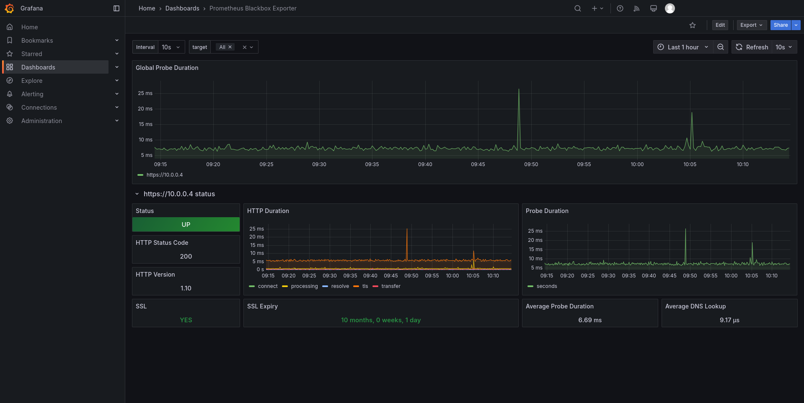

# Mise en place d’un serveur de bastion
VANNESTE Lucas - SLIMANI Robin


## Sommaire

1. [Introduction](#introduction)
2. [Contexte du Projet](#contexte-du-projet)
3. [Choix de la Technologie de Bastion](#choix-de-la-technologie-de-bastion)
4. [Comparaison des Solutions](#comparaison-des-solutions)
5. [Architecture et Infrastructure](#architecture-et-infrastructure)
6. [Compte Rendu de l'Interview](#compte-rendu-de-linterview)
7. [Description Complète de l'Infrastructure Choisie Finalement](#description-complète-de-linfrastructure-choisie-finalement)
8. [Installation et Configuration](#installation-et-configuration)
9. [Fonctionnalités Implémentées](#fonctionnalités-implémentées)
10. [Problèmes Rencontrés et Solutions](#problèmes-rencontrés-et-solutions)
11. [Conclusion](#conclusion)


## Introduction

Ce projet a pour objectif la mise en place d'un serveur de bastion centralisé, permettant aux administrateurs de gérer et sécuriser l'accès à divers serveurs et services dans un environnement multi-client. Le bastion doit être flexible, évolutif, et capable de s'adapter à des configurations technologiques variées. Il vise à simplifier la gestion des connexions SSH en utilisant des certificats à la place des mots de passe et utilisateurs, tout en centralisant les accès pour éviter la gestion de multiples adresses IP. De plus, le bastion doit offrir des fonctionnalités avancées telles que l'authentification à double facteur, la journalisation des connexions, et une interface web ou CLI pour la gestion.

### Objectifs du Projet

1. **Centralisation des Accès** : Le bastion doit permettre une gestion centralisée des connexions aux différents serveurs et services, en utilisant des certificats pour renforcer la sécurité.

2. **Flexibilité et Adaptabilité** : Le système doit être suffisamment flexible pour s'adapter à des environnements technologiques variés, incluant des configurations Docker, des bases de données, des services SaaS, et des serveurs FTP.

3. **Sécurité Renforcée** : L'implémentation de l'authentification à double facteur et la journalisation des connexions sont essentielles pour garantir un niveau de sécurité élevé.

4. **Interface Utilisateur** : Fournir une interface web ou CLI intuitive pour permettre aux administrateurs de gérer facilement les accès et les connexions.

5. **Gestion Granulaire des Accès** : Permettre une gestion fine des accès en fonction des rôles des administrateurs et des besoins spécifiques des clients.

## Contexte du Projet

Le projet s'inscrit dans un contexte où une société doit gérer les accès à des environnements variés pour plusieurs clients. Chaque client peut avoir plusieurs environnements (développement, staging, production), chacun constitué de divers services tels que des bases de données, des serveurs web, des serveurs de cache, etc. Le bastion doit permettre de trier les connexions par client et environnement, offrant ainsi une gestion structurée et sécurisée des accès.

### Fonctionnalités Attendues

Pour répondre aux besoins de la société, le bastion doit offrir les fonctionnalités suivantes :

1. **Connexion Centralisée** :
   - Trier les connexions par client et environnement.
   - Permettre l'accès à des services variés tels que des bases de données, des serveurs web, des serveurs de cache, etc.

2. **Flexibilité Technologique** :
   - S'adapter à des configurations variées, incluant des environnements Docker, des services SaaS, et des serveurs traditionnels.
   - Supporter des technologies spécifiques comme MongoDB Atlas, Redis, et des serveurs FTP.

3. **Actions Spécifiques** :
   - Se connecter directement à des prompts de bases de données (MariaDB, MongoDB, Redis).
   - Monter des dossiers distants en local avec SSHFS.
   - Effectuer des dumps et restaurations de bases de données.
   - Lancer des connexions RDP sur des serveurs Windows.

4. **Gestion des Accès** :
   - Permettre une gestion granulaire des accès en fonction des rôles des administrateurs.
   - Offrir des fonctionnalités avancées comme l'authentification à double facteur et la journalisation des connexions.

5. **Technologies Standards** :
   - Fonctionner avec des technologies standards sans nécessiter l'installation d'utilitaires spécifiques sur les serveurs.

### Bonus

- **Authentification à Double Facteur** : Pour renforcer la sécurité des connexions.
- **Journalisation des Connexions** : Pour assurer une traçabilité des accès et des actions effectuées.
- **CLI pour les Administrateurs** : Pour offrir une interface en ligne de commande en plus de l'interface web.
- **Création de Tunnels** : Pour accéder à des services non directement accessibles, comme DBeaver sur un serveur distant.

## Précisions

La solution doit être auto-hébergée et fonctionner sur un serveur dédié, tel qu'un petit VPS. La forme de la solution est libre et peut inclure une application web, une suite de scripts bash, un serveur SSH customisé, ou une solution open source customisée. Des solutions comme Apache Guacamole et Teleport peuvent servir d'inspiration pour la mise en œuvre de ce projet.


## Choix de la Technologie de Bastion

Après une analyse comparative approfondie, deux technologies principales ont été retenues pour la mise en place du serveur de bastion : **Apache Guacamole** et **Teleport**. Chacune de ces solutions présente des avantages et des inconvénients qui les rendent adaptées à différents contextes et besoins.

### Comparaison des Solutions

| Critères                | Apache Guacamole                                      | Teleport                                                                 |
|-------------------------|------------------------------------------------------|--------------------------------------------------------------------------|
| **Accès aux protocoles**| RDP, VNC, SSH via une interface web                  | SSH, RDP, Kubernetes API, bases de données                               |
| **Interface utilisateur**| Interface web intuitive accessible depuis n'importe quel navigateur, sans nécessiter de client supplémentaire. | Fournit une interface web ainsi que des outils en ligne de commande, adaptés aux environnements DevOps et aux workflows automatisés. |
| **Gestion des accès**  | Intégration avec LDAP et autres systèmes d'authentification pour la gestion des utilisateurs et des permissions. | Offre une gestion granulaire des accès basée sur des rôles, avec des politiques de moindre privilège et une conformité aux principes de Zero Trust. |
| **Journalisation et audit** | Fonctionnalités de journalisation des connexions, mais avec des capacités limitées en termes de détails et d'analyse approfondie. | Fournit une journalisation détaillée des sessions, incluant l'enregistrement des activités des utilisateurs, facilitant les audits de sécurité et la conformité réglementaire. |
| **Scalabilité et environnement cloud** | Principalement conçu pour des environnements traditionnels, avec des limitations dans les environnements cloud-native et distribués. | Conçu pour les environnements cloud-native, avec une scalabilité horizontale et une gestion efficace des infrastructures distribuées et multi-cloud. |
| **Sécurité avancée**  | Authentification multifactorielle (MFA) et le chiffrement des connexions, mais peut nécessiter des configurations supplémentaires pour des fonctionnalités de sécurité avancées. | Intègre des fonctionnalités de sécurité avancées, telles que l'authentification sans mot de passe, les clés FIDO2/U2F, et une conformité native aux standards de sécurité modernes, renforçant la posture de sécurité globale. |
| **Intégration et API** | Dispose d'API documentées permettant une intégration avec d'autres applications, bien que l'étendue puisse être limitée. | Offre des API robustes et une intégration transparente avec divers outils DevOps, facilitant l'automatisation et l'orchestration des workflows. |
| **Coût et licence**    | Solution open source gratuite sous licence Apache 2.0, avec support communautaire. | Propose une version open source avec des fonctionnalités de base, ainsi que des offres commerciales pour des fonctionnalités avancées et un support dédié. |

### Pourquoi Choisir Teleport ?

1. **Adaptabilité aux Environnements Variés** :
   - Notre projet implique la gestion de multiples clients et environnements utilisant diverses technologies, y compris des services hébergés sur Docker, des bases de données SaaS, et des serveurs sans Docker. Teleport, avec son support multi-protocoles et sa conception orientée cloud-native, offre la flexibilité nécessaire pour s'adapter à ces configurations hétérogènes.

2. **Gestion Granulaire des Accès** :
   - La nécessité de définir des permissions spécifiques pour différents administrateurs requiert une solution capable de gérer des politiques d'accès détaillées. Teleport permet une gestion fine des rôles et des permissions, alignée avec les principes de moindre privilège et de Zero Trust, assurant que chaque administrateur dispose uniquement des accès nécessaires à ses fonctions.

3. **Sécurité Renforcée** :
   - Avec des fonctionnalités telles que l'authentification sans mot de passe, le support natif des clés de sécurité matérielles (FIDO2/U2F), et une journalisation exhaustive des sessions, Teleport offre une sécurité robuste, essentielle pour protéger des environnements sensibles et répondre aux exigences de conformité.

4. **Scalabilité et Performance** :
   - Conçu pour les infrastructures modernes et distribuées, Teleport peut évoluer efficacement avec la croissance de notre organisation, garantissant des performances optimales même à grande échelle.

5. **Intégration et Automatisation** :
   - Les API robustes de Teleport et son intégration fluide avec les outils DevOps facilitent l'automatisation des workflows, améliorant ainsi l'efficacité opérationnelle et réduisant les risques d'erreurs humaines.

### Conclusion

Bien qu'Apache Guacamole offre des fonctionnalités intéressantes pour l'accès distant via une interface web, Teleport se distingue par sa capacité à gérer des environnements complexes et variés, sa sécurité avancée, et sa scalabilité. Ces caractéristiques en font une solution plus adaptée aux besoins spécifiques de notre projet de bastion de connexion. Teleport permet non seulement de centraliser et sécuriser les accès, mais aussi de s'adapter aux exigences modernes des infrastructures cloud-native, tout en offrant une flexibilité et une intégration optimales avec les outils DevOps.

## Architecture et Infrastructure

### Schéma des Infrastructures

#### Infrastructure avec Teleport


#### Infrastructure avec Apache Guacamole


### Compte Rendu de l'Interview

Pour orienter notre choix technologique pour le projet de mise en place d'un serveur de bastion, nous avons eu l'opportunité d'interviewer un professionnel du domaine. Cet échange nous a permis de mieux comprendre les avantages et les inconvénients des différentes solutions disponibles, et de nous orienter vers la solution la plus adaptée à nos besoins.

#### Solution Principale : Teleport

**Recommandation du Professionnel :**
- **Teleport** a été retenu comme la base principale pour notre projet. Cette solution offre des fonctionnalités avancées en matière de sécurité, notamment l'authentification multifactorielle et l'audit des connexions. Elle permet également une gestion centralisée et intuitive des accès, tout en offrant une grande flexibilité pour intégrer diverses technologies telles que Docker, les bases de données, et les services SaaS.

**Avantages de Teleport :**
- **Sécurité renforcée** : Authentification multifactorielle et journalisation détaillée des sessions.
- **Gestion centralisée** : Interface intuitive pour la gestion des accès et des rôles.
- **Flexibilité** : Capacité à s'intégrer avec divers environnements et technologies.

#### Autres Solutions Proposées

**Open Source :**

1. **Apache Guacamole :**
   - **Avantage** : Interface web intuitive pour gérer les connexions RDP, SSH, et VNC.
   - **Intégration** : Possibilité d'intégration avec Elasticsearch pour la journalisation des logs via le protocole SNLPL.

2. **OpenNebula :**
   - **Utilisation** : Pour la gestion et l'orchestration des ressources cloud.

3. **NoMachine :**
   - **Caractéristiques** : Solution d'accès à distance axée sur les performances pour les connexions RDP et SSH.

**Commercial :**

4. **Azure Bastion :**
   - **Caractéristiques** : Bastion cloud natif d'Azure, bien adapté aux environnements Azure mais moins flexible pour des environnements multi-cloud ou on-premise.

5. **RustDesk et GoToResolve :**
   - **Utilisation** : Outils pour l'accès à distance, mais moins adaptés à un bastion centralisé.

6. **Terraform :**
   - **Recommandation** : Principalement pour l'infrastructure as code et l'automatisation.

#### Infrastructure Recommandée

**Hyperviseur :**
- **Proxmox** a été recommandé pour sa capacité à gérer efficacement les ressources virtuelles.

**Répartition des Services :**
- **VM 1** : Apache Guacamole.
- **VM 2** : OpenNebula ou Teleport.

**Système d'Exploitation :**
- **ArchLinux ou ArchOS** pour leur légèreté et leur flexibilité.

**Outil pour les ISO Windows :**
- **Utilitaire ChrisTitus Mcrowin (Winutil)** pour créer une image ISO optimisée de Windows pour les VMs.

#### Erreurs à Éviter

- **Certificats** : Toujours utiliser des certificats valides pour sécuriser les connexions.
- **Isolation** : Privilégier Docker pour isoler les ressources et réduire les risques liés à la mutualisation.
- **Journalisation** : Ne pas négliger les logs, essentiels pour l'audit et la sécurité.

#### Recommandations Supplémentaires

- **Recherche de Projets Préexistants** : Explorer les projets open source sur GitHub pour trouver des solutions de bastion personnalisées ou des inspirations.
- **Solution sur Mesure** : Déconseillée, car souvent moins sécurisée et moins fonctionnelle que les solutions open source existantes.

#### Prochaines Étapes

- **Tests** : Tester Teleport et Apache Guacamole pour confirmer leur pertinence dans le projet.
- **Configuration de l'Infrastructure** : Basée sur Proxmox avec deux VMs pour séparer les services.
- **Intégration** : Intégrer Elasticsearch avec Teleport pour la journalisation des connexions.

#### Liste de Solutions et Documentation

Voici une liste de solutions open source et de projets GitHub pour la mise en place d'un bastion de connexion, accompagnée de leurs liens officiels vers la documentation :

1. **Teleport**
   - Documentation : [Teleport](https://goteleport.com/docs/)

2. **Apache Guacamole**
   - Documentation : [Apache Guacamole](https://guacamole.apache.org/doc/)

3. **The Bastion (OVH)**
   - Documentation : [The Bastion (OVH)](https://ovh.github.io/the-bastion/)

4. **Bastillion**
   - Documentation : [Bastillion](https://github.com/bastillion-io/Bastillion)

5. **HashiCorp Boundary**
   - Documentation : [HashiCorp Boundary](https://www.boundaryproject.io/docs)

6. **NoMachine**
   - Documentation : [NoMachine](https://www.nomachine.com/documentation)

7. **OpenNebula**
   - Documentation : [OpenNebula](https://docs.opennebula.io/)

8. **Terraform**
   - Documentation : [Terraform](https://developer.hashicorp.com/terraform/docs)

9. **RustDesk**
   - Documentation : [RustDesk](https://rustdesk.com/docs/)

10. **GoTo Resolve**
    - Documentation : [GoTo Resolve](https://support.goto.com/resolve/help)

11. **Azure Bastion**
    - Documentation : [Azure Bastion](https://learn.microsoft.com/en-us/azure/bastion/)

12. **Jumpserver**
    - Documentation : [Jumpserver](https://www.jumpserver.org/en-us/docs/)

13. **WebTerminal**
    - Documentation : [WebTerminal](https://github.com/joewalnes/websocketd)

#### Tableau Comparatif des Solutions

| Solution                | Avantages                                                                 | Inconvénients                                                                 |
|-------------------------|--------------------------------------------------------------------------|-----------------------------------------------------------------------------|
| Teleport                | - Sécurité renforcée avec authentification multifactorielle et audit.  | - Peut nécessiter une configuration initiale complexe.                      |
|                         | - Intégration native avec diverses technologies.                         | - Certaines fonctionnalités avancées sont réservées à la version entreprise.|
| Apache Guacamole        | - Accès distant via le web sans besoin de client supplémentaire.        | - Configuration initiale pouvant être complexe.                             |
|                         | - Supporte RDP, SSH, VNC, et d'autres protocoles.                      | - Peut nécessiter des ajustements pour une intégration complète.            |
| The Bastion (OVH)       | - Gestion centralisée des accès SSH avec traçabilité et auditabilité.   | - Principalement axé sur les connexions SSH.                               |
| Bastillion              | - Interface web pour la gestion des connexions SSH.                     | - Fonctionnalités limitées aux connexions SSH.                              |
| HashiCorp Boundary      | - Contrôle d'accès dynamique basé sur des identités.                   | - Solution relativement nouvelle, peut manquer de maturité.               |
| NoMachine               | - Performances élevées pour l'accès distant aux bureaux.             | - Moins adapté pour la gestion centralisée des accès à des serveurs multiples.|
| OpenNebula              | - Plateforme complète de gestion de cloud et de virtualisation.       | - Complexité élevée, peut être excessive pour un simple bastion de connexion.|
| Terraform               | - Infrastructure as Code pour la gestion des ressources.             | - Nécessite des compétences en codage et en gestion d'infrastructure.       |
| RustDesk                | - Solution open source pour le contrôle à distance.                   | - Fonctionnalités limitées pour la gestion centralisée des accès.          |
| GoTo Resolve            | - Solution complète pour le support à distance avec des fonctionnalités de gestion. | - Solution propriétaire avec des coûts associés.                           |
| Azure Bastion           | - Intégration transparente avec les services Azure.                   | - Limité aux environnements Azure.                                         |
| Jumpserver              | - Bastion open source axé sur les connexions SSH et RDP.              | - Interface utilisateur un peu rudimentaire.                                |
| WebTerminal             | - Solution légère pour des connexions SSH via navigateur.            | - Fonctionnalités limitées.                                                |

#### Remarques Supplémentaires

- **Certificats** : Tous les services exposés doivent être protégés par des certificats valides pour éviter les risques de compromission.
- **Journalisation** : Centraliser les logs via des outils comme Elasticsearch ou Splunk pour un suivi et un audit efficaces.

Cette interview a été essentielle pour nous guider dans le choix de la solution la plus adaptée à notre projet, en tenant compte des besoins spécifiques et des contraintes techniques.
## Description Complète de l'Infrastructure Choisie Finalement

### Architecture Globale

L'infrastructure mise en place pour ce projet de serveur de bastion est conçue pour offrir une gestion centralisée et sécurisée des accès à divers services et environnements clients. Elle repose sur plusieurs composants clés, chacun jouant un rôle spécifique dans la sécurité, la gestion des accès, et le monitoring des performances.

### Serveur Bastion Principal

**Serveur central hébergeant les composants suivants :**

- **Teleport** : Gestion des connexions et des accès. Teleport centralise les accès sécurisés aux environnements clients, permettant une gestion fine des rôles et des permissions. Il supporte l'authentification multifactorielle (MFA) et l'enregistrement des sessions pour audit.

- **Fail2ban** : Protection contre les attaques par force brute. Fail2ban surveille les journaux générés par SSH et bloque les IP après un nombre défini de tentatives échouées.

- **Prometheus et Grafana** : Monitoring et tableau de bord. Prometheus collecte les métriques système et applicatives, tandis que Grafana permet de visualiser ces données pour surveiller les performances et détecter les anomalies.

### Services Clients

**Divers services hébergés chez les clients, accessibles via le bastion :**

- **Bases de données** : MariaDB, MongoDB, Redis.
- **Serveurs web** : Apache, Nginx.
- **Instances Docker** : Pour des environnements de développement et de staging.
- **Services SaaS** : Comme MongoDB Atlas.
- **Serveurs RDP** : Pour les environnements Windows.

### Monitoring et Logs

- **Prometheus** : Collecte des métriques système et applicatives. Il surveille les performances des services Teleport et des infrastructures clientes, et permet de configurer des alertes pour détecter les anomalies.

- **Grafana** : Visualisation des données pour surveiller les performances et détecter les anomalies. Grafana offre des tableaux de bord personnalisés pour visualiser les métriques collectées par Prometheus.

### Composants Clés

1. **Teleport (Bastion de connexion)**
   - **Rôle** : Centraliser les accès sécurisés aux environnements clients.
   - **Fonctionnalités principales** :
     - Accès aux serveurs SSH, RDP, Kubernetes et bases de données.
     - Authentification multifactorielle (MFA).
     - Enregistrement des sessions pour audit.
     - Gestion des rôles pour une attribution d'accès granulaire.
     - Création de tunnels sécurisés pour accéder aux services non exposés.

3. **Fail2ban (Protection contre les attaques)**
   - **Rôle** : Protéger les services contre les attaques par force brute.
   - **Configuration** :
     - Surveillance des journaux générés par SSH.
     - Blocage des IP après un nombre défini de tentatives échouées.

5. **Prometheus (Monitoring)**
   - **Rôle** : Collecter et stocker les métriques système et applicatives.
   - **Fonctionnalités principales** :
     - Surveillance des performances des services Teleport et des infrastructures clientes.
     - Collecte des métriques système (CPU, mémoire, etc.).
     - Alertes configurables pour détecter les anomalies (CPU élevé, latence, etc.).

6. **Grafana (Tableaux de bord de visualisation)**
   - **Rôle** : Fournir des tableaux de bord personnalisés pour visualiser les métriques collectées par Prometheus.
   - **Fonctionnalités principales** :
     - Tableaux de bord pour surveiller les connexions Teleport, l’état des infrastructures clientes, et l’utilisation des ressources.

### Infrastructures Clients

1. **Typologies d’environnements clients :**

   - **Client 1** :
     - Environnement Dev et Staging sur Docker mutualisé.
     - Production hébergée sur un serveur dédié.

   - **Client 2** :
     - Base de données MongoDB Atlas (SaaS).
     - Serveurs web mutualisés pour Staging et Production.

   - **Client 3** :
     - Serveur FTP simple pour des fichiers spécifiques.
     - Instance Redis pour le cache.

   - **Client 4** :
     - Serveurs Windows accessibles via RDP.
     - Bases de données MariaDB pour les applications métier.

2. **Intégration avec le bastion :**
   - Les connexions aux infrastructures clientes sont gérées via Teleport, avec des tunnels SSH sécurisés pour les services non exposés.
   - Les actions spécifiques (connexion base de données, etc.) sont préconfigurées dans Teleport.

### Avantages de l'Infrastructure

- **Sécurisation Renforcée** :
  - Authentification MFA.
  - Protection contre les attaques par force brute (Fail2ban).

- **Supervision Efficace** :
  - Prometheus surveille les performances des services et des infrastructures clientes.
  - Grafana offre une vue d’ensemble claire et des alertes en temps réel.

- **Flexibilité et Scalabilité** :
  - Teleport permet de gérer facilement des environnements clients variés.


## Installation et Configuration

### Installation de Proxmox

#### 1.1 Installation de Proxmox

Nous avons débuté le projet en installant Proxmox à partir d'un ISO open-source. Cette installation a été réalisée sur deux postes différents, ce qui nous a permis de créer un cluster afin de mutualiser les ressources et d'optimiser les performances des machines virtuelles.

- **Téléchargement de l'ISO** : Nous avons téléchargé l'ISO de Proxmox VE depuis le site officiel.
- **Création des Supports d'Installation** : L'ISO a été utilisé pour créer des supports d'installation bootables (clé USB ou DVD).
- **Installation sur les Postes** : Chaque poste a été démarré à partir du support d'installation, et nous avons suivi le processus d'installation de Proxmox VE, incluant la configuration initiale du système, telle que la définition de l'adresse IP, du nom d'hôte, et des paramètres réseau de base.

#### 1.2 Configuration Réseau

Nous avons configuré les interfaces réseau de notre serveur Proxmox avec les paramètres suivants :

- **vmbr0** : Interface principale connectée au réseau externe avec une adresse IP statique. Cette interface permet aux machines virtuelles d'accéder au réseau externe et à Internet.

- **vmbr1** : Interface pour le réseau interne des machines virtuelles avec une adresse IP privée. Cette interface permet la communication entre les machines virtuelles au sein du cluster.

**Exemple de Configuration du Fichier `/etc/network/interfaces` :**

```bash
auto lo
iface lo inet loopback

iface enp0s31f6 inet manual

auto vmbr0
iface vmbr0 inet static
    address 100.64.85.9/24
    gateway 100.64.85.254
    bridge-ports enp0s31f6
    bridge-stp off
    bridge-fd 0

auto vmbr1
iface vmbr1 inet static
    address 10.0.1.1/24
    bridge-ports none
    bridge-stp off
    bridge-fd 0
```

#### Mise en Place des Routes d’Accès aux Machines Virtuelles avec Netplan

Nous avons configuré les routes d'accès aux machines virtuelles en utilisant Netplan, un outil de configuration réseau pour les systèmes basés sur Ubuntu.

**Édition du Fichier `/etc/netplan/50-cloud-init.yaml` :**

```yaml
network:
  version: 2
  ethernets:
    enp0s31f6:
      dhcp4: true
      nameservers:
        addresses:
          - 100.64.85.7
      routes:
        - to: 10.0.1.0/24
          via: 100.64.85.9
        - to: 10.0.0.0/24
          via: 100.64.85.13
```

**Application des Changements :**

Après avoir édité le fichier de configuration Netplan, nous avons appliqué les modifications avec la commande suivante :

```bash
sudo netplan apply
```

#### 1.3 Création du Cluster Proxmox

Pour la création du cluster, nous avons utilisé l'interface graphique complète de Proxmox VE. Cette interface offre une méthode intuitive pour configurer et gérer les clusters, facilitant ainsi le processus.

- **Initialisation du Cluster** :
  - Nous avons accédé à l'interface web de Proxmox sur l'un des nœuds.
  - Dans le menu "Datacenter", nous avons sélectionné "Create Cluster" pour initialiser un nouveau cluster.

- **Ajout du Deuxième Nœud** :
  - Toujours via l'interface web, nous avons ajouté le deuxième nœud au cluster en fournissant son adresse IP et les informations de connexion nécessaires.
  - L'interface web a guidé le processus, assurant que les deux nœuds sont correctement configurés et connectés.

- **Validation du Cluster** :
  - Nous avons vérifié l'état du cluster via l'interface web pour nous assurer que les deux nœuds sont opérationnels et que les ressources sont correctement mutualisées.
  - L'interface web a également permis de surveiller les performances et la santé du cluster.

Cette configuration permet de mutualiser les ressources des deux nœuds Proxmox, offrant ainsi une infrastructure robuste et évolutive pour héberger les machines virtuelles nécessaires au projet de bastion.


### Configuration du DNS

Pour assurer une gestion efficace des communications entre nos différentes machines virtuelles, nous avons mis en place un serveur DNS utilisant Bind9. Ce serveur DNS permet de créer un sous-réseau et d'attribuer des noms de domaine aux services internes, facilitant ainsi leur identification et leur accès. En outre, un autre serveur DNS sur une machine de l'IUT permet de résoudre le nom `teleport.teleport.com` pour accéder au client en ligne Teleport.

#### 1.3 Création d'un Serveur DNS

**Objectif :**
- Gérer les communications internes entre les machines virtuelles.
- Faciliter l'accès aux services via des noms de domaine internes.
- Configurer un DNS externe pour résoudre `teleport.teleport.com`.

**Configuration du Serveur DNS Externe :**

1. **Installation de Bind9 :**
   - Nous avons commencé par mettre à jour les paquets du système et installer Bind9 :
     ```bash
     sudo apt update && sudo apt install bind9 -y
     ```

2. **Configuration de la Zone DNS Externe :**
   - **Édition du Fichier de Configuration :**
     - Nous avons ajouté la zone DNS pour `teleport.com` dans le fichier `/etc/bind/named.conf.local` :
       ```bash
       zone "teleport.com" {
           type master;
           file "/etc/bind/db.teleport.com";
       };
       ```

   - **Création du Fichier de Zone :**
     - Le fichier `/etc/bind/db.teleport.com` a été créé avec le contenu suivant :
       ```bash
       $TTL    604800
       @       IN      SOA     ns1.teleport.com. admin.teleport.com. (
                              2024122802 ; Serial (augmenté)
                              604800     ; Refresh
                              86400      ; Retry
                              2419200   ; Expire
                              604800 )  ; Negative Cache TTL

       ; NS records
       @       IN      NS      ns1.teleport.com.
       ns1     IN      A       100.64.85.7

       ; A records
       @       IN      A       100.64.85.13
       teleport IN     A       100.64.85.13
       *.teleport IN   A       100.64.85.13
       ```

   - **Redémarrage du Service Bind9 :**
     - Après avoir configuré les fichiers, nous avons redémarré le service Bind9 pour appliquer les modifications :
       ```bash
       sudo systemctl restart bind9
       ```

**Configuration du Serveur DNS Interne :**

1. **Ajout de la Zone DNS Interne :**
   - Nous avons ajouté la zone DNS pour `teleport.teleport.com` dans le fichier de configuration Bind9 :
     ```bash
     zone "teleport.teleport.com" {
         type master;
         file "/etc/bind/db.teleport";
     };
     ```

2. **Création du Fichier de Zone Interne :**
   - Le fichier `/etc/bind/db.teleport` a été créé avec le contenu suivant :
     ```bash
     $TTL 604800
     @   IN  SOA teleport.teleport.com. root.teleport.teleport.com. (
             2         ; Serial
             604800    ; Refresh
             86400     ; Retry
             2419200   ; Expire
             604800 )  ; Negative Cache TTL
     ;
     @   IN  NS  teleport.teleport.com.
     @   IN  A   192.168.1.10
     ```

**Remarques :**
- Nous avons utilisé Bind9 pour sa robustesse et sa capacité à gérer des configurations DNS complexes.
- La configuration DNS externe permet de résoudre le nom `teleport.teleport.com`, facilitant l'accès au service Teleport depuis l'extérieur du réseau local.
- La configuration DNS interne permet une gestion simplifiée des noms de domaine pour les services internes, améliorant ainsi l'organisation et l'accessibilité des ressources au sein du réseau virtuel.

Cette configuration DNS assure une gestion centralisée et efficace des communications réseau, facilitant ainsi la maintenance et l'extension future de l'infrastructure.


### Installation de Teleport

#### 3.1 Téléchargement et Installation

Pour installer Teleport, nous avons suivi les étapes suivantes :

1. **Récupération du Package** :
   - Nous avons téléchargé le package d'installation de Teleport depuis le site officiel. La version choisie était la version open-source (`oss`) de Teleport, spécifiquement la version `17.3.2`.
   - La commande suivante a été utilisée pour télécharger et installer Teleport :
     ```bash
     TELEPORT_EDITION="oss"
     TELEPORT_VERSION="17.3.2"
     curl https://cdn.teleport.dev/install-v17.3.3.sh | bash -s ${TELEPORT_VERSION?} ${TELEPORT_EDITION?}
     ```

#### 3.2 Configuration de Teleport

1. **Création du Fichier de Configuration** :
   - Nous avons créé un répertoire pour stocker les fichiers de configuration de Teleport :
     ```bash
     sudo mkdir -p /etc/teleport
     ```
   - Ensuite, nous avons créé et édité le fichier de configuration `teleport.yaml` :
     ```bash
     sudo nano /etc/teleport/teleport.yaml
     ```

2. **Ajout de la Configuration** :
   - Le fichier de configuration a été adapté aux besoins spécifiques de notre infrastructure. Voici un exemple de configuration :
     ```yaml
     version: v3
     teleport:
       nodename: teleport
       data_dir: /var/lib/teleport
       log:
         output: stderr
         severity: INFO
         format:
           output: text
       ca_pin: ""
       diag_addr: ""
     auth_service:
       enabled: "yes"
       listen_addr: 0.0.0.0:3025
       cluster_name: teleport.teleport.com
       proxy_listener_mode: multiplex
       session_recording: "proxy"
     ssh_service:
       enabled: "yes"
     proxy_service:
       enabled: "yes"
       web_listen_addr: 0.0.0.0:443
       ssh_public_addr: 0.0.0.0:3022
       public_addr: teleport.teleport.com:443
       https_keypairs:
         - cert_file: /etc/teleport/certs/teleport.crt
           key_file: /etc/teleport/certs/teleport.key
       acme:
         enabled: "no"
     app_service:
       enabled: "yes"
       apps:
         - name: "-mount"
           uri: "http://localhost:5000"
           public_addr: "sshfs-mount.teleport.teleport.com"
           commands:
             - name: "monter_sshfs"
               command: ["/usr/local/bin/mount-teleport.sh"]
               period: 5m
     ```

#### 3.3 Gestion des Certificats

Lors de l'installation de Teleport, nous avons rencontré des problèmes liés aux certificats, car nous ne disposions pas d'une autorité de certification officielle. Pour contourner cette contrainte, nous avons tenté de désactiver autant que possible l'utilisation des certificats, compte tenu du fait qu'il s'agit d'un projet scolaire.

- **Configuration des Certificats** :
  - Les certificats ont été configurés dans le fichier `teleport.yaml` sous la section `https_keypairs`.
  - Nous avons spécifié les chemins vers les fichiers de certificat et de clé, même si ces fichiers n'étaient pas signés par une autorité de certification officielle.

#### 3.4 Démarrage et Activation du Service

1. **Lancement de Teleport** :
   - Nous avons lancé Teleport en arrière-plan en utilisant la commande suivante :
     ```bash
     teleport start --config=/etc/teleport/teleport.yaml
     ```

2. **Activation du Service pour le Démarrage Automatique** :
   - Pour garantir que Teleport démarre automatiquement au démarrage du système, nous avons activé et démarré le service Teleport avec les commandes suivantes :
     ```bash
     sudo systemctl enable teleport
     sudo systemctl start teleport
     ```

Cette configuration permet à Teleport de gérer les connexions et les accès de manière sécurisée et centralisée, tout en s'adaptant aux besoins spécifiques de notre infrastructure.


### Configuration des Clients

Pour intégrer les différents services clients à Teleport, nous avons configuré chaque machine avec un token, permettant leur identification et leur intégration au client Teleport. Voici les détails pour chaque type de client configuré :

#### 3.2.1 Client MariaDB

**Objectif :** Configurer un serveur MariaDB pour qu'il soit accessible via Teleport.

1. **Installation de MariaDB :**
   - Nous avons commencé par installer MariaDB sur la machine :
     ```bash
     sudo apt update
     sudo apt install mariadb-server -y
     ```
   - Ensuite, nous avons démarré et activé le service MariaDB :
     ```bash
     sudo systemctl start mariadb
     sudo systemctl enable mariadb
     ```
   - Pour sécuriser l'installation, nous avons exécuté :
     ```bash
     sudo mysql_secure_installation
     ```

2. **Création de la Base de Données et de l'Utilisateur :**
   - Nous avons créé une base de données et un utilisateur pour accéder à cette base :
     ```sql
     CREATE DATABASE testdb_dev;
     CREATE USER 'client2'@'localhost' IDENTIFIED BY 'client2';
     GRANT ALL PRIVILEGES ON testdb_dev.* TO 'client2'@'localhost';
     FLUSH PRIVILEGES;
     CREATE USER 'client2r'@'%' IDENTIFIED VIA mysql_ssl;
     GRANT ALL PRIVILEGES ON testdb_dev.* TO 'client2'@'%' REQUIRE SSL;
     FLUSH PRIVILEGES;
     ```

3. **Configuration SSL pour MariaDB :**
   - Nous avons modifié le fichier de configuration de MariaDB pour activer le transport sécurisé :
     ```ini
     [mysqld]
     require-secure-transport = on
     ssl-ca = /etc/mysql/ssl/mariadb-identity.pem.cas
     ssl-cert = /etc/mysql/ssl/mariadb-identity.pem.crt
     ssl-key = /etc/mysql/ssl/mariadb-identity.pem.key
     ```

4. **Installation de Teleport sur la Machine :**
   - Nous avons installé Teleport sur la machine MariaDB :
     ```bash
     TELEPORT_EDITION="oss"
     TELEPORT_VERSION="17.3.2"
     curl https://cdn.teleport.dev/install-v17.3.3.sh | bash -s ${TELEPORT_VERSION?} ${TELEPORT_EDITION?}
     ```

5. **Ajout du Client à Teleport :**
   - Nous avons généré un token sur le cluster Teleport :
     ```bash
     sudo tctl tokens add --ttl=50m --type=db
     ```
   - Puis, nous avons configuré le client MariaDB avec ce token dans `/etc/teleport/teleport.yaml` :
     ```yaml
     version: v3
     teleport:
       nodename: "client2-dev"
       data_dir: /var/lib/teleport
       log:
         output: stderr
         severity: INFO
         format:
           output: text
       ca_pin: "sha256:75da5bf8caae4fc42e7a24e790221ab879f72d3e0d0d628dad6bb4dd2881c539"
       auth_token: "b43bacab25082aa4b80c53cb269726f6"
       proxy_server: "teleport.teleport.com:443"
       diag_addr: ""
     auth_service:
       enabled: "no"
       listen_addr: 0.0.0.0:3025
       cluster_name: teleport.teleport.com
       proxy_listener_mode: multiplex
     ssh_service:
       enabled: "yes"
     proxy_service:
       enabled: "no"
     db_service:
       enabled: "yes"
       databases:
         - name: mariadb-dev
           protocol: mysql
           uri: 10.0.1.4:3306
           tls:
             mode: verify-ca
     ```
   - Enfin, nous avons lancé et activé Teleport :
     ```bash
     sudo teleport start --config=/etc/teleport/teleport.yaml
     sudo systemctl enable teleport
     sudo systemctl start teleport
     ```

#### 3.2.2 Client RDP Windows

**Objectif :** Configurer un accès RDP à une machine Windows via Teleport.

1. **Configuration de Teleport pour RDP :**
   - Nous avons suivi la documentation officielle de Teleport pour configurer l'accès RDP.
   - Sur une machine Linux, nous avons configuré Teleport pour accéder à la machine Windows :
     ```yaml
     version: v3
     teleport:
       nodename: windows
       proxy_server: teleport.teleport.com:443
       auth_token: /etc/token
     windows_desktop_service:
       enabled: yes
       static_hosts:
         - name: host1
           ad: false
           addr: 10.0.0.2:3389
     auth_service:
       enabled: no
     proxy_service:
       enabled: no
     ssh_service:
       enabled: no
     ```

#### 3.2.3 Client Docker

**Objectif :** Configurer des conteneurs Docker avec Teleport pour une architecture de site web.

1. **Création des Dockerfiles :**
   - Nous avons créé des Dockerfiles pour différents services (backend, web, MariaDB) avec Teleport intégré.
   - Exemple de Dockerfile pour le backend :
     ```dockerfile
     FROM ubuntu:22.04

     ENV DEBIAN_FRONTEND=noninteractive

     RUN apt-get update && apt-get install -y \
         openssh-server \
         curl \
         php \
         php-cli \
         php-fpm \
         sudo

     RUN useradd -m admin && echo "admin:admin" | chpasswd && adduser admin sudo

     RUN curl -LO https://get.gravitational.com/teleport_16.4.12_amd64.deb \
         && dpkg -i teleport_16.4.12_amd64.deb \
         && rm teleport_16.4.12_amd64.deb

     RUN mkdir -p /var/run/sshd

     EXPOSE 3024

     CMD service ssh start && \
         service php7.4-fpm start || service php8.1-fpm start && \
         teleport start --config=/etc/teleport/teleport.yaml
     ```

2. **Configuration Teleport pour Docker :**
   - Exemple de fichier `teleport.yaml` pour le backend :
     ```yaml
     version: v3
     teleport:
       nodename: "client-prod-backend"
       data_dir: /var/lib/teleport
       auth_token: "ad89b8f67138227c37b05be2c1e5a07d"
       ca_pin: "sha256:75da5bf8caae4fc42e7a24e790221ab879f72d3e0d0d628dad6bb4dd2881c539"
       auth_servers:
         - 10.0.0.4:3025
     ssh_service:
       enabled: "yes"
       listen_addr: 0.0.0.0:3024
     auth_service:
       enabled: "no"
     proxy_service:
       enabled: "no"
     ```

3. **Docker Compose :**
   - Nous avons utilisé Docker Compose pour orchestrer les conteneurs :
     ```yaml
     version: '3.8'
     services:
       web:
         build:
           context: ./web
           dockerfile: Dockerfile
         container_name: web
         ports:
           - "8080:80"
           - "3023:3023"
         volumes:
           - "./web/teleport.yaml:/etc/teleport/teleport.yaml:ro"
       backend:
         build:
           context: ./backend
           dockerfile: Dockerfile
         container_name: backend
         ports:
           - "3024:3024"
         volumes:
           - "./backend/teleport.yaml:/etc/teleport/teleport.yaml:ro"
       mariadb:
         build:
           context: ./mariadb
           dockerfile: Dockerfile
         container_name: mariadb
         ports:
           - "3306:3306"
           - "3030:3030"
         volumes:
           - "./mariadb/teleport.yaml:/etc/teleport/teleport.yaml:ro"
         environment:
           - MYSQL_ROOT_PASSWORD=root
           - MYSQL_DATABASE=demo
           - MYSQL_USER=admin
           - MYSQL_PASSWORD=admin
     ```

#### 3.2.4 Client SSHFS

**Objectif :** Faciliter l'accès aux fichiers des machines distantes via SSHFS en utilisant Teleport.

1. **Service Web Flask :**
   - Nous avons développé un petit serveur Flask pour fournir une interface web pour la connexion et le montage SSHFS.
   - Le serveur Flask permet aux utilisateurs de se connecter à Teleport, de choisir un serveur distant et un dossier à monter.

2. **Script de Montage SSHFS :**
   - Le script `mount-teleport.sh` exécute les commandes nécessaires pour établir la connexion et monter le dossier distant via Teleport.
   - Exemple de commande pour monter un dossier distant :
     ```bash
     sshfs -o proxycommand="tsh proxy ssh --cluster=<cluster> %h:%p" <utilisateur>@<serveur>:<répertoire_distant> /mnt/sshfs
     ```

3. **Service Systemd :**
   - Nous avons créé un service systemd pour s'assurer que le serveur Flask tourne en continu et redémarre automatiquement si nécessaire.
   - Installation et activation du service :
     ```bash
     sudo systemctl enable sshfs-web.service
     sudo systemctl start sshfs-web.service
     ```

     [SSHFS quick presentation](https://youtu.be/lDO9RoUnc2A)

#### 3.2.5 Client FTP

**Objectif :** Configurer un serveur FTP sécurisé et léger avec vsftpd.

1. **Installation de vsftpd :**
   - Nous avons installé vsftpd sur la machine :
     ```bash
     sudo apt update
     sudo apt install vsftpd -y
     ```

2. **Configuration de vsftpd :**
   - Nous avons modifié le fichier de configuration `/etc/vsftpd.conf` pour sécuriser et configurer le serveur FTP :
     ```ini
     anonymous_enable=NO
     local_enable=YES
     write_enable=YES
     chroot_local_user=YES
     user_sub_token=$USER
     local_root=/home/$USER/ftp
     allow_writeable_chroot=YES
     pasv_enable=YES
     pasv_min_port=40000
     pasv_max_port=50000
     ```

3. **Création d'un Utilisateur FTP :**
   - Nous avons créé un utilisateur spécifique pour le FTP et configuré les permissions :
     ```bash
     sudo adduser ftpuser
     sudo mkdir -p /home/ftpuser/ftp/upload
     sudo chown -R ftpuser:ftpuser /home/ftpuser/ftp
     sudo chmod 750 /home/ftpuser/ftp
     sudo chmod 770 /home/ftpuser/ftp/upload
     ```

4. **Configuration du Firewall :**
   - Nous avons ouvert les ports nécessaires pour le FTP :
     ```bash
     sudo ufw allow 20/tcp         # FTP data (actif)
     sudo ufw allow 21/tcp         # FTP control
     sudo ufw allow 40000:50000/tcp # FTP passif (data)
     ```

5. **Connexion au Serveur FTP :**
   - Exemple de connexion via SSH avec un saut vers le bastion :
     ```bash
     sftp -J ton_user@teleport.teleport.com ftpuser@10.0.1.6
     ```

Ces configurations permettent d'intégrer divers services clients à Teleport, offrant ainsi une gestion centralisée et sécurisée des accès.


### Fonctionnalités Implémentées

#### Centralisation des Accès

- **Utilisation de Teleport** : Nous avons utilisé Teleport pour gérer les connexions SSH, RDP, et les accès aux bases de données. Teleport permet de centraliser et de sécuriser les accès en utilisant des certificats à la place des mots de passe et utilisateurs. Cela simplifie la gestion des connexions et réduit le risque d'erreurs humaines liées à la gestion des identifiants.

#### Sécurité Renforcée

- **Authentification Multifactorielle (MFA)** : Teleport supporte l'authentification multifactorielle, ajoutant une couche supplémentaire de sécurité pour les connexions.
- **Journalisation des Sessions** : Chaque session est enregistrée, permettant un audit complet des activités des utilisateurs. Cela est essentiel pour la conformité réglementaire et pour identifier toute activité suspecte.

#### Flexibilité

- **Support des Environnements Divers** : Teleport supporte les environnements Docker, les services SaaS, et les serveurs traditionnels. Cette flexibilité permet de s'adapter à diverses configurations technologiques utilisées par les clients.
- **Gestion Granulaire des Accès** : Les administrateurs peuvent définir des rôles et des permissions spécifiques, assurant que chaque utilisateur dispose uniquement des accès nécessaires à ses fonctions.

#### Monitoring

- **Utilisation de Prometheus et Grafana** : Nous avons mis en place un système de monitoring utilisant Prometheus pour la collecte des métriques et Grafana pour la visualisation des données. Cela permet de surveiller les performances des services et de détecter les anomalies en temps réel.

### Détails des Technologies Extérieures à Teleport

#### 4.1 Monitoring

Pour le monitoring, nous avons décidé de surveiller les ressources les plus importantes : le service Teleport, le cluster Proxmox, et le client MariaDB. Le cluster Proxmox est particulièrement crucial car il offre une visibilité sur toutes les machines virtuelles, qu'elles soient en cours d'exécution ou arrêtées, et permet de surveiller des paramètres comme l'utilisation de la RAM.

##### 4.1.1 Installation de Prometheus

- **Choix de la Machine** : Nous avons utilisé une machine distincte pour installer Prometheus, afin de garantir que le monitoring reste opérationnel même si l'infrastructure Teleport rencontre des problèmes.

- **Commandes d'Installation** :
  - Nous avons configuré les routes réseau nécessaires :
    ```yaml
    network:
      version: 2
      ethernets:
        enp0s31f6:
          dhcp4: true
          nameservers:
            addresses:
              - 100.64.85.7
          routes:
            - to: 10.0.1.0/24
              via: 100.64.85.9
            - to: 10.0.0.0/24
              via: 100.64.85.13
    ```
  - Application des modifications réseau :
    ```bash
    sudo netplan apply
    ```
  - Téléchargement et installation de Prometheus :
    ```bash
    wget https://github.com/prometheus/prometheus/releases/download/v3.2.1/prometheus-3.2.1.linux-amd64.tar.gz
    tar -xvzf prometheus-3.2.1.linux-amd64.tar.gz
    cd prometheus-3.2.1.linux-amd64
    sudo useradd --no-create-home --shell /bin/false prometheus
    sudo mkdir /etc/prometheus /var/lib/prometheus
    sudo chown prometheus:prometheus /etc/prometheus /var/lib/prometheus
    sudo mv prometheus /usr/local/bin/
    sudo mv promtool /usr/local/bin/
    sudo mv consoles/ console_libraries/ prometheus.yml /etc/prometheus/
    sudo chown -R prometheus:prometheus /etc/prometheus
    ```
  - Création du service systemd pour Prometheus :
    ```ini
    [Unit]
    Description=Prometheus
    Wants=network-online.target
    After=network-online.target

    [Service]
    User=prometheus
    Group=prometheus
    Type=simple
    ExecStart=/usr/local/bin/prometheus --config.file=/etc/prometheus/prometheus.yml --storage.tsdb.path=/var/lib/prometheus/

    [Install]
    WantedBy=multi-user.target
    ```
  - Activation et démarrage du service :
    ```bash
    sudo systemctl daemon-reload
    sudo systemctl enable prometheus
    sudo systemctl start prometheus
    ```

##### 4.1.2 Configuration de Prometheus

- **Fichier de Configuration** :
  - Le fichier `prometheus.yml` a été configuré pour surveiller différentes cibles, chacune ayant un exporter spécifique :
    ```yaml
    global:
      scrape_interval: 5s
      scrape_timeout: 5s
      scrape_protocols:
        - OpenMetricsText1.0.0
        - OpenMetricsText0.0.1
        - PrometheusText0.0.4
      evaluation_interval: 1m
    runtime:
      gogc: 75
    scrape_configs:
      - job_name: node_exporter
        static_configs:
          - targets: ['100.64.85.13:9100', '100.64.85.9:9100']
      - job_name: blackbox
        params:
          module: [http_2xx]
        static_configs:
          - targets: ['https://10.0.0.4']
      - job_name: windows_exporter
        static_configs:
          - targets: ['10.0.0.2:9182']
      - job_name: mysql
        static_configs:
          - targets: ['10.0.1.4:3306', 'unix:///run/mysqld/mysqld.sock']
      - job_name: pve
        static_configs:
          - targets: ['100.64.85.13', '100.64.85.9']
    ```

##### 4.1.3 Installation de Grafana

- **Installation** :
  - Nous avons installé Grafana pour visualiser les données collectées par Prometheus :
    ```bash
    sudo apt update && sudo apt install -y software-properties-common
    sudo add-apt-repository "deb https://packages.grafana.com/oss/deb stable main"
    wget -q -O - https://packages.grafana.com/gpg.key | sudo apt-key add -
    sudo apt update && sudo apt install -y grafana
    sudo systemctl start grafana-server
    sudo systemctl enable grafana-server
    ```
  - Après l'installation, nous avons configuré des tableaux de bord en ligne pour surveiller les performances des services.

##### 4.1.4 Installation des Exporters

- **Exemple avec Node Exporter** :
  - Installation de Node Exporter sur une machine du cluster Proxmox :
    ```bash
    curl -LO https://github.com/prometheus/node_exporter/releases/download/v1.9.0/node_exporter-1.9.0.linux-amd64.tar.gz
    tar -xvf node_exporter-1.9.0.linux-amd64.tar.gz
    sudo mv node_exporter-1.9.0.linux-amd64/node_exporter /usr/local/bin/
    sudo useradd -r -s /bin/false node_exporter
    sudo chown node_exporter:node_exporter /usr/local/bin/node_exporter
    ```
  - Création d'un service systemd pour Node Exporter :
    ```ini
    [Unit]
    Description=Node Exporter 1.9.0
    After=network.target

    [Service]
    User=node_exporter
    Group=node_exporter
    Type=simple
    ExecStart=/usr/local/bin/node_exporter

    [Install]
    WantedBy=multi-user.target
    ```
  - Activation et démarrage du service :
    ```bash
    sudo systemctl daemon-reload
    sudo systemctl enable --now node_exporter
    ```

    Voici l'exemple du dashboard pour les machines cluster de proxmox vous pourrez trouver tous les autres dashboard en annexe.
    
    

#### 4.2 Installation et Configuration de Fail2Ban

- **Packages Utilisés** :
  - Installation de Fail2Ban :
    ```bash
    sudo apt install fail2ban -y
    ```
  - Fail2Ban inclut `fail2ban-server`, le démon principal qui surveille les logs, et `fail2ban-client`, un outil pour interagir avec le démon.

- **Configuration** :
  - Création d'un fichier `jail.local` pour personnaliser les règles de bannissement :
    ```ini
    [DEFAULT]
    bantime = 1h
    findtime = 10m
    maxretry = 5
    backend = systemd

    [sshd]
    enabled = true
    port = ssh
    logpath = /var/log/auth.log
    ```
  - Création d'un filtre spécifique pour Teleport :
    ```ini
    [Definition]
    failregex = .*Failed login attempt.*from <HOST>
    ```
  - Ajout d'une jail dédiée pour Teleport dans `jail.local` :
    ```ini
    [teleport]
    enabled = true
    port = ssh
    filter = teleport
    logpath = /var/lib/teleport/logs/teleport.log
    maxretry = 3
    bantime = 1h
    ```
  - Redémarrage de Fail2Ban :
    ```bash
    sudo systemctl restart fail2ban
    ```

#### 4.3 Client Local : Teleport Connect

- **Configuration** :
  - Nous avons installé Teleport Connect sur les postes locaux pour permettre une connexion similaire à l'interface web.
  - Désactivation de la vérification des certificats, car nous n'avions pas d'autorité de certification officielle.

Ces fonctionnalités et configurations permettent de garantir une gestion centralisée, sécurisée, et efficace des accès et des performances des services, tout en offrant une flexibilité et une scalabilité adaptées aux besoins des clients.


### Problèmes Rencontrés et Solutions

Lors de la mise en œuvre de ce projet, plusieurs défis ont été rencontrés, nécessitant des solutions adaptées pour assurer le bon fonctionnement de l'infrastructure. Voici un aperçu détaillé des problèmes rencontrés et des solutions mises en place.

#### 5.1 Installation de Proxmox

**Problème :**
- L'installation des deux serveurs Proxmox a été compliquée par le fait que le réseau de l'IUT bloquait la création d'hyperviseurs en ne leur attribuant pas d'adresse IP. Cela a empêché les machines virtuelles de se connecter correctement au réseau.

**Solution :**
- Nous avons obtenu une autorisation spéciale de l'IUT pour permettre l'attribution d'adresses IP aux hyperviseurs.
- En l'absence de plage IP dédiée, nous avons configuré un sous-réseau `vmbr1` pour les machines virtuelles, ce qui a permis de gérer les adresses IP de manière plus flexible et de contourner les limitations du réseau principal.

#### 5.2 Création du DNS

**Problème :**
- La mise en place du serveur DNS a été entravée par des restrictions réseau de l'IUT. Le réseau refusait les requêtes DNS provenant d'une IP inconnue, et seul le serveur DNS de l'IUT était autorisé à effectuer des résolutions DNS.

**Solution :**
- Nous avons configuré notre serveur DNS pour utiliser le serveur DNS de la salle comme forwarder, qui à son tour utilisait le serveur DNS de l'IUT. Cela a permis de respecter les politiques réseau de l'IUT tout en permettant à notre serveur DNS de fonctionner correctement.

#### 5.3 Installation de Teleport

**Problème :**
- Lors de l'installation de Teleport, nous avons rencontré des problèmes liés aux certificats, car nous ne disposions pas d'une autorité de certification officielle. Cela a compliqué la configuration des connexions sécurisées.

**Solution :**
- Pour contourner ce problème, nous avons désactivé la vérification des certificats autant que possible, en particulier pour les environnements de test. Cela a permis de poursuivre l'installation et la configuration de Teleport sans bloquer le projet.

#### 5.4 Connexion aux Prompts de Bases de Données

**Problème :**
- Nous avons rencontré de nombreux problèmes de certificats lors de la configuration des connexions directes aux prompts de bases de données comme MongoDB et MariaDB. Les certificats fournis par Teleport n'étaient pas toujours reconnus, ce qui empêchait l'établissement des connexions.

**Solution :**
- Pour MariaDB, nous avons utilisé les certificats signés par Teleport, ce qui a permis de résoudre les problèmes de connexion.
- Pour MongoDB, malgré la désactivation de la vérification des certificats, des problèmes persistent. 

Ces solutions ont permis de surmonter les obstacles techniques rencontrés tout au long du projet, assurant ainsi la mise en place d'une infrastructure fonctionnelle et sécurisée. Chaque problème a été l'occasion d'apprendre et d'adapter les configurations pour répondre aux contraintes spécifiques de notre environnement.

## Conclusion

Le projet a permis de mettre en place un serveur de bastion robuste et flexible, capable de gérer des environnements multi-clients avec des technologies variées. Teleport s'est avéré être la solution la plus adaptée grâce à sa gestion granulaire des accès, sa sécurité renforcée, et sa scalabilité.

## Annexes

#### annexe 1 : cluster proxmox 

#### annexe 2 : Teleport

#### annexe 3 : Etat du service Teleport

#### annexe 4 : MariaDB


### Sources

Pour la réalisation de ce projet, nous avons consulté diverses ressources en ligne, incluant des tutoriels, des vidéos, et des documentations officielles. Ces sources nous ont fourni les informations nécessaires pour choisir et configurer les technologies appropriées, ainsi que pour résoudre les problèmes rencontrés.

1. **Tutoriel sur Apache Guacamole** :
   - **Lien** : [Tutoriel Apache Guacamole](https://www.it-connect.fr/tuto-apache-guacamole-bastion-rdp-ssh-debian/)
   - **Description** : Ce tutoriel explique comment installer et configurer Apache Guacamole sur Debian pour créer un bastion RDP et SSH. Il fournit des instructions détaillées pour la mise en place de l'interface web et l'intégration avec d'autres services.

2. **Vidéo YouTube sur Apache Guacamole** :
   - **Lien** : [YouTube - Apache Guacamole](https://www.youtube.com/watch?v=F6ot2VO8O5U)
   - **Description** : Cette vidéo présente une démonstration complète de l'installation et de la configuration d'Apache Guacamole, en mettant l'accent sur les aspects pratiques et les meilleures pratiques.

3. **Déploiement de Teleport** :
   - **Lien** : [Déploiement de Teleport](https://www.it-connect.fr/comment-deployer-un-bastion-dadministration-avec-la-solution-open-source-teleport/)
   - **Description** : Cet article détaille le processus de déploiement de Teleport en tant que solution de bastion d'administration. Il couvre les étapes d'installation, de configuration, et d'intégration avec divers services.

4. **Vidéo YouTube sur Teleport** :
   - **Lien** : [YouTube - Teleport](https://www.youtube.com/watch?v=099aaji_J1w&t=497s)
   - **Description** : Cette vidéo offre un guide visuel pour installer et configurer Teleport, en expliquant les fonctionnalités clés et les avantages de cette solution.

5. **Installation de Proxmox VE** :
   - **Lien** : [Installation de Proxmox VE](https://www.it-connect.fr/comment-installer-proxmox-ve-7-0-et-creer-sa-premiere-vm/)
   - **Description** : Ce tutoriel explique comment installer Proxmox VE et créer la première machine virtuelle. Il fournit des instructions claires pour la configuration initiale et la gestion des ressources virtuelles.

6. **Documentation Officielle de Teleport** :
   - **Lien** : [Teleport Documentation](https://goteleport.com/docs/installation/)
   - **Description** : La documentation officielle de Teleport fournit des guides détaillés pour l'installation, la configuration, et l'utilisation de Teleport dans divers environnements.

7. **GitHub** :
   - **Lien** : [GitHub](https://github.com)
   - **Description** : GitHub a été une ressource précieuse pour explorer des projets open source liés à la mise en place de bastions de connexion, fournissant des exemples de configurations et des solutions personnalisées.

8. **Documentation sur l'Accès RDP avec Teleport** :
   - **Lien** : [Teleport Desktop Access](https://goteleport.com/docs/enroll-resources/desktop-access/getting-started/)
   - **Description** : Cette documentation explique comment configurer l'accès RDP avec Teleport, en fournissant des instructions détaillées pour l'intégration avec des environnements Windows.

Ces ressources nous ont permis de comprendre les différentes options disponibles pour la mise en place d'un bastion de connexion, et de choisir les solutions les plus adaptées à nos besoins spécifiques. Elles ont également été essentielles pour résoudre les problèmes techniques rencontrés tout au long du projet.

